# Agent Pred — System Design & Implementation Plan

> **Plan type:** System design + Execution plan
> **Date:** 2026-03-11
> **Input:** PLAN.md v3.2 (Part I decomposition + Part II blocks), PMXT_REFERENCE.md, POLYMARKET_CLI_GUIDE.md
> **Scope:** Research playground for Polymarket prediction market trading via NautilusTrader

---

## 1. Problem & Scope

We are building a **self-improving research playground** where LLM agents design experiments, a deterministic runner executes them through NautilusTrader, and agents analyze results — iterating toward profitable Polymarket strategies.

The system must:
1. Load historical PMXT orderbook data into NautilusTrader's backtest engine (streaming, memory-safe)
2. Define market universes from slug patterns and resolve them to instruments + data
3. Run strategies in backtest/paper/live with identical code paths
4. Log everything to MLflow for structured experiment comparison
5. Support an agentic loop: strategist → runner → analyst → repeat

### Scope Boundary

| In Scope | Out of Scope |
|----------|-------------|
| PMXT historical data → NautilusTrader backtest pipeline | Rust-side NautilusTrader modifications |
| Universe management (slug patterns → markets → instruments) | Building new exchange adapters |
| Experiment runner with automated metrics + MLflow logging | ML model training infrastructure |
| Agentic loop (strategist + analyst agents) | Multi-venue portfolio optimization |
| Paper + live trading through existing adapter | Continuous live data recording pipeline |

### Server Constraints

| Constraint | Impact | Design Response |
|-----------|--------|-----------------|
| ~40GB storage | Cannot download full PMXT archive (~12GB/day) | Selective download by market + time range |
| Limited RAM | Cannot load 300-700MB parquet files into memory | Stream via HTTP range requests, column pruning, row filtering |
| Single server | All components colocated | SQLite for MLflow backend, local file storage |

---

## 2. System Architecture

### 2.1 Component Overview

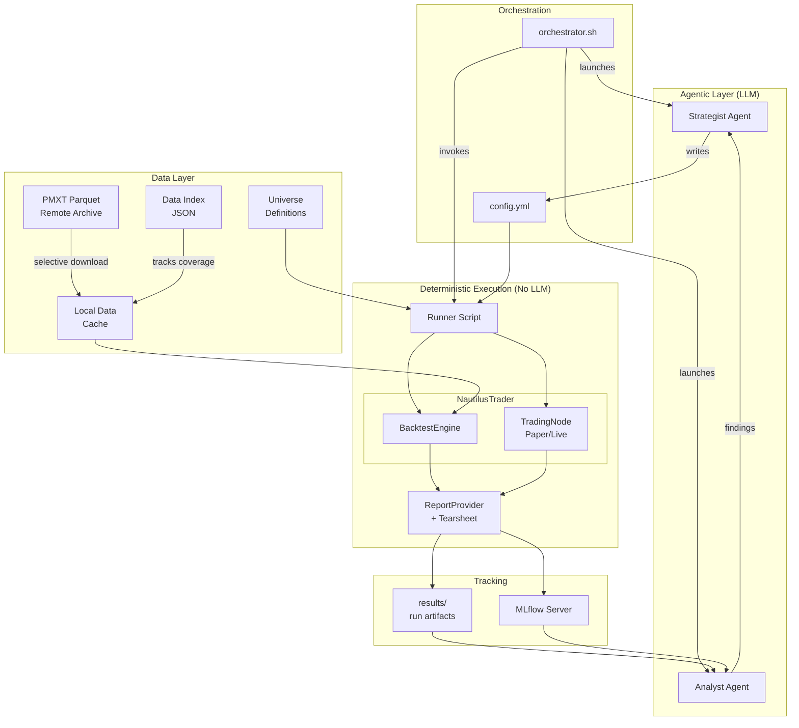

### 2.2 The Invariant

**The LLM never touches the hot path.** Agents write code and configs. The runner executes them through NautilusTrader deterministically. Agents read finished reports.

```
Strategist writes → Runner executes → Analyst reads
     ↑                                      │
     └──────────── next experiment ──────────┘
```

### 2.3 Component Boundaries

| Component | Owns | Does NOT Own |
|-----------|------|-------------|
| **PMXT Transformer** | Download, filter, convert parquet → NT types | Market discovery, instrument metadata |
| **Universe System** | Slug patterns → condition_ids, instrument construction | Data download, strategy logic |
| **Runner** | Engine setup, strategy instantiation, tearsheet computation, MLflow logging | Strategy logic, data acquisition |
| **Strategist Agent** | Hypothesis generation, strategy code, experiment config | Execution, metrics computation |
| **Analyst Agent** | Result interpretation, cross-run comparison | Strategy design, execution |
| **MLflow** | Experiment hierarchy, metric storage, artifact tracking | Computation, strategy logic |

---

## 3. Data Architecture

This section covers the most critical design decisions: how data flows from PMXT archive through NautilusTrader.

### 3.1 PMXT Schema (Verified)

Five columns per hourly parquet file (~300-700MB, ~13M rows):

| Column | Type | Description |
|--------|------|-------------|
| `timestamp_received` | `timestamp[ms, tz=UTC]` | When update was received |
| `timestamp_created_at` | `timestamp[ms, tz=UTC]` | When record was created |
| `market_id` | `string` | Condition ID hash (`0xbcf53c26...`) |
| `update_type` | `string` | `price_change` or `book_snapshot` |
| `data` | `string` | JSON blob — format depends on `update_type` |

Two update types with very different frequencies:

| Type | Frequency | JSON Fields | Maps To |
|------|-----------|-------------|---------|
| `price_change` | ~99.8% of rows | token_id, side, best_bid, best_ask, change_price, change_size, change_side, timestamp | `OrderBookDelta` (single level change) |
| `book_snapshot` | ~0.2% of rows | token_id, side, best_bid, best_ask, bids, asks, timestamp | `OrderBookDeltas` (CLEAR + all levels) |

### 3.2 Data Flow: PMXT → BacktestEngine

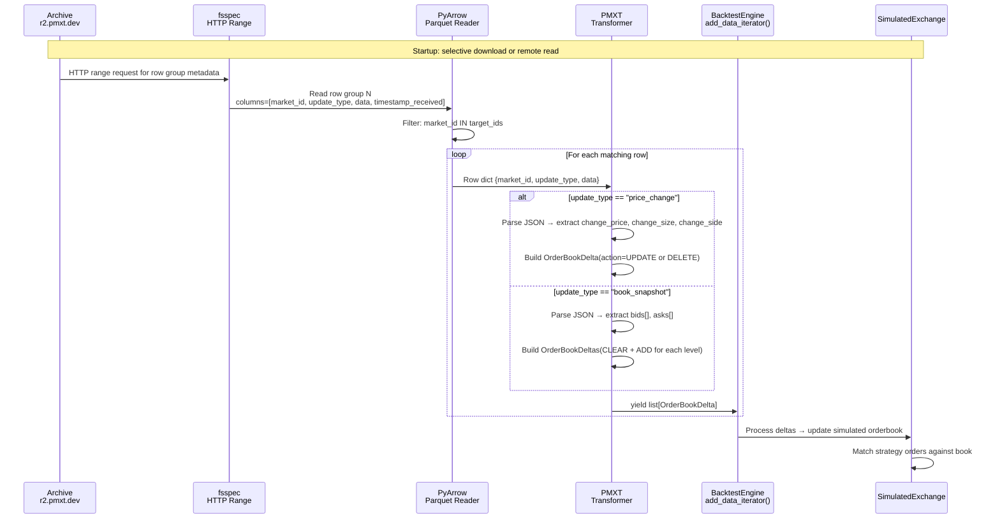

### 3.3 PMXT ↔ WebSocket Alignment

A critical discovery: **the existing Polymarket adapter already handles order book data via WebSocket**, not just trades. The WebSocket market channel receives the same data types as PMXT:

| PMXT Update Type | WebSocket Message Tag | NT Output Type | Adapter Handler |
|------------------|----------------------|----------------|-----------------|
| `price_change` | `"price_change"` | `OrderBookDelta` + `QuoteTick` | `data.py:450` `_handle_quote()` |
| `book_snapshot` | `"book"` | `OrderBookDeltas` (CLEAR + ADDs) | `data.py:384` `_handle_book_snapshot()` |
| *(not in PMXT)* | `"last_trade_price"` | `TradeTick` | `data.py:537` `_handle_trade()` |

**Consequence:** Block 3 ("Order Book WebSocket") does NOT require building a new WebSocket connection. The adapter already connects to `wss://ws-subscriptions-clob.polymarket.com/ws/market` and processes order book data. The work is verifying field-level alignment between PMXT JSON and WebSocket JSON, then reusing parsing logic.

### 3.4 Dual-Path Data Flow (The Core Invariant)

Both the historical (backtest) and live (paper/live) paths must produce **identical NautilusTrader types**. This diagram shows the two paths side by side:

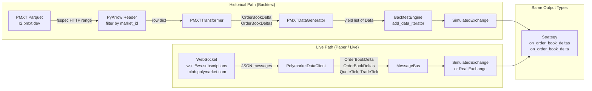

**The invariant:** A strategy receives identical callback signatures and data shapes regardless of whether it's running against PMXT historical data or live WebSocket data. The only differences are:
- Timestamp units at the source (seconds vs milliseconds — both converted to nanoseconds)
- Batching (PMXT: 1 row = 1 delta; WS: 1 message = N deltas — but both produce individual `OrderBookDelta` objects)
- `order_id` is `0` in both paths (L2 data has no order identity)

### 3.5 PMXT Field Mapping to NautilusTrader

#### `price_change` → `OrderBookDelta`

| PMXT JSON Field | NT Field | Transformation |
|----------------|----------|----------------|
| `change_side` ("BUY"/"SELL") | `BookOrder.side` | "BUY" → `OrderSide.BUY`, "SELL" → `OrderSide.SELL` |
| `change_price` ("0.18") | `BookOrder.price` | `instrument.make_price(float(v))` |
| `change_size` ("100" or "0") | `BookOrder.size` / `action` | "0" → `BookAction.DELETE` + size=0; else → `BookAction.UPDATE` |
| `token_id` | `instrument_id` lookup | Map token_id → InstrumentId via universe registry |
| `timestamp` (unix float) | `ts_event` | `int(v * 1_000_000_000)` (seconds → nanoseconds) |
| *(constant)* | `BookOrder.order_id` | `0` — matches adapter behavior (`data.py:462`, `schemas/book.py:85,109`, `deltas.py:73,92,119,138`). L2 data has no meaningful order identity. |

> **Why `order_id=0`?** The live adapter uses `order_id=0` for all L2 book data because Polymarket's WebSocket doesn't provide order-level IDs — only price levels. The PMXT transformer MUST use the same value. Different order_id generation between backtest and live paths would cause the `SimulatedExchange` to track book state differently, producing silent matching divergence.

#### Timestamp Handling (Critical)

PMXT and the WebSocket adapter use **different timestamp units** for the same semantic value:

| Source | Field | Unit | Conversion to Nanoseconds |
|--------|-------|------|--------------------------|
| **PMXT JSON** `data` blob | `timestamp` | Unix **seconds** (float, e.g. `1773046869.0186121`) | `int(v * 1_000_000_000)` |
| **WebSocket** message | `timestamp` | Unix **milliseconds** (string, e.g. `"1773046869019"`) | `millis_to_nanos(float(v))` |
| **PMXT Parquet** column | `timestamp_received` | `timestamp[ms, tz=UTC]` | Fallback only — convert ms → ns |

**Rules for the PMXT transformer:**
1. **`ts_event`** = JSON `data.timestamp` field (seconds → nanos via `int(v * 1_000_000_000)`)
2. **`ts_init`** = same as `ts_event` for historical data (in the live adapter, `ts_init = now_ns`, but for replay there is no "now")
3. **Do NOT use `millis_to_nanos()`** for PMXT data — that's for the WebSocket path. PMXT timestamps are seconds, not milliseconds.
4. **Fallback:** If the JSON `timestamp` field is missing (unlikely but defensive), use the Parquet `timestamp_received` column (already in ms, convert to ns).

#### `book_snapshot` → `OrderBookDeltas`

| PMXT JSON Field | NT Construction | Notes |
|----------------|-----------------|-------|
| *(first delta)* | `OrderBookDelta(action=CLEAR, order=None)` | Clear existing book |
| `bids` array | `OrderBookDelta(action=ADD, side=BUY, price, size)` per level | F_LAST on final bid if no asks |
| `asks` array | `OrderBookDelta(action=ADD, side=SELL, price, size)` per level | F_LAST on final ask |
| All deltas | `OrderBookDeltas(instrument_id, deltas)` | Wrapped as batch |

### 3.6 Data Access Strategy

Given ~40GB storage and 300-700MB per hourly file:

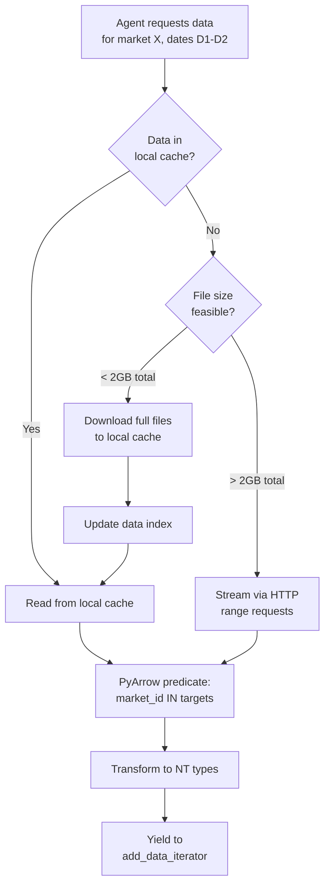

**Critical: raw PMXT files contain ALL markets (~thousands). We only need rows for the markets in our universe.** Never cache raw files — always filter first.

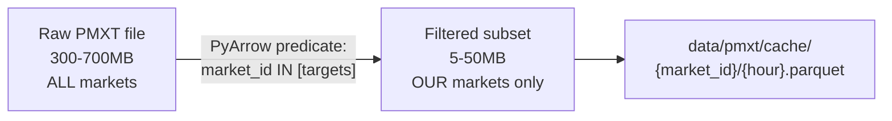

**Data pipeline:**

1. **Stream** raw file via HTTP range requests (never download full raw file)
2. **Filter** rows to only target market_ids using PyArrow predicate pushdown
3. **Cache** the filtered subset as small per-market parquet files
4. **Index** what's cached so we never re-download

This means a 500MB raw file might produce 5MB of cached data for 2-3 markets.

| Step | What Happens | Storage Cost |
|------|-------------|-------------|
| Stream from PMXT | Read via `fsspec` HTTP, zero disk usage | 0 |
| Filter rows | PyArrow predicate on `market_id` column | 0 (in memory, row-group at a time) |
| Cache filtered | Write per-market parquet to `data/pmxt/cache/` | Small (only our markets) |
| Re-access | Read directly from cache | 0 (already on disk) |

**Data index** (`data/pmxt/index.json`):
```json
{
  "markets": {
    "0xbcf53c26...": {
      "slug": "bitcoin-above-100k",
      "hours_cached": ["2026-03-09T14", "2026-03-09T15"],
      "cache_size_mb": 12.3
    }
  },
  "total_cache_size_mb": 847,
  "cache_budget_mb": 10000
}
```

---

## 4. Universe System

### 4.1 Resolution Chain

```mermaid
flowchart LR
    SLUG[Slug Pattern<br/>"election-*"] --> RESOLVE[Universe Resolver]
    RESOLVE -->|Gamma API<br/>or CLI| MARKETS[Market Metadata<br/>condition_id, token_ids,<br/>outcome, slug]
    MARKETS --> INST[BinaryOption<br/>Instruments]
    MARKETS --> DATA[PMXT Data<br/>Filter by market_id]

    INST --> BT[BacktestEngine<br/>add_instrument]
    DATA --> BT

    INST --> PT[TradingNode<br/>InstrumentProvider]
```

### 4.2 Universe Definition Format

```yaml
# universes/election_2024.yml
universe_id: "election-2024"
description: "US 2024 election prediction markets"

# Market selection (at least one required)
selection:
  slugs:                           # Glob patterns matched against market slugs
    - "presidential-election-*"
    - "will-*-win-*"
  tags: ["politics"]               # Polymarket event tags
  condition_ids:                   # Direct condition_id list (optional)
    - "0xabc123..."

# Filters (applied after selection)
filters:
  active: true
  min_volume: 10000                # Minimum total volume in USDC
  min_liquidity: 1000              # Minimum current liquidity

# Time range (for historical/backtest)
period:
  start: "2024-06-01"
  end: "2024-11-30"

# Live mode settings
live:
  slug_builder: "strategies.slugs:build_election_slugs"
  refresh_interval_mins: 60
```

### 4.3 Resolution by Mode

| Mode | How Instruments Are Built | How Data Is Sourced |
|------|--------------------------|-------------------|
| **Backtest** | Constructed from cached market metadata + PMXT data | PMXT parquet files filtered by market_id |
| **Paper** | `PolymarketInstrumentProvider` via Gamma API (slug_builder or load_ids) | Live WebSocket |
| **Live** | Same as paper | Live WebSocket |

**Backtest instrument construction** requires cached market metadata (from Gamma API or CLI, stored as JSON):

```json
{
  "condition_id": "0xbcf53c26...",
  "token_id": "75467129...",
  "outcome": "Yes",
  "slug": "bitcoin-above-100k",
  "tick_size": "0.001",
  "min_order_size": "5",
  "end_date": "2026-12-31T00:00:00Z",
  "neg_risk": false
}
```

This metadata is fetched once (via `polymarket clob market <condition_id> -o json`) and cached locally. The universe resolver uses it to construct `BinaryOption` instruments for backtesting.

---

## 5. Experiment Execution

### 5.1 Runner Data Flow

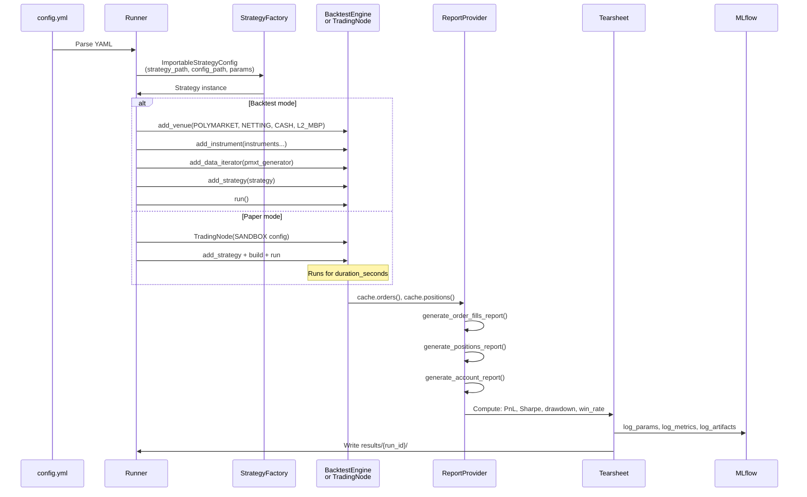

### 5.2 Tearsheet Metrics

| Metric | Source | Computation |
|--------|--------|-------------|
| `total_pnl` | positions_report | `sum(realized_pnl)` |
| `num_trades` | fills_report | `len(fills)` |
| `num_positions` | positions_report | `len(positions)` |
| `win_rate` | positions_report | `count(realized_pnl > 0) / total` |
| `sharpe_ratio` | PnL series | `mean(returns) / std(returns) * sqrt(252)` |
| `max_drawdown` | equity curve | Max peak-to-trough decline |
| `avg_trade_pnl` | positions_report | `mean(realized_pnl)` |
| `profit_factor` | positions_report | `sum(wins) / abs(sum(losses))` |

### 5.3 MLflow Hierarchy

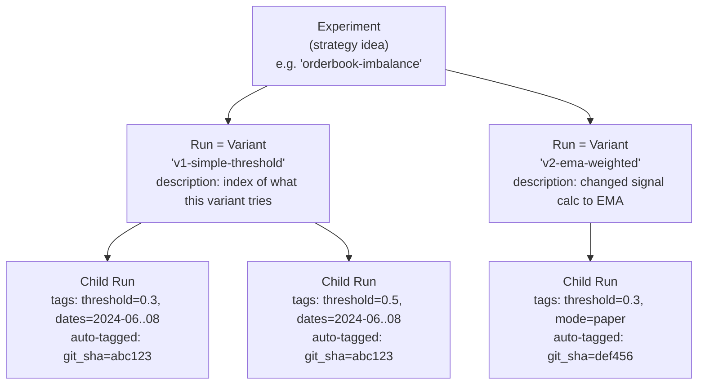

| Level | Maps To | Contains | Naming |
|-------|---------|----------|--------|
| **Experiment** | Strategy idea (e.g. "orderbook-imbalance") | All variants of this idea | Semantic name |
| **Run** | Conceptual variant — a different approach or twist | Description of what this variant tries, index of child runs | Semver-ish: `v1-simple-threshold`, `v2-ema-weighted` |
| **Child Run** | Single execution (backtest or paper) | Metrics, CSV artifacts, tearsheet | Auto-generated run ID |

**Every child run is auto-tagged with:**
- `git_sha` — exact commit that ran (verifiable, non-negotiable)
- `strategy_file` — path to the strategy .py file
- Hyperparameters — all config values as tags
- `date_range` — start/end of data window
- `mode` — backtest / paper / live
- `universe` — which universe definition was used

**Each parent run (variant) has:**
- A short semantic name (the variant identity)
- A description explaining what this variant changes vs previous variants
- An artifact `variants_index.md` at the experiment level tracking the evolution of ideas

---

## 6. Agentic Loop

### 6.1 Agent Roles

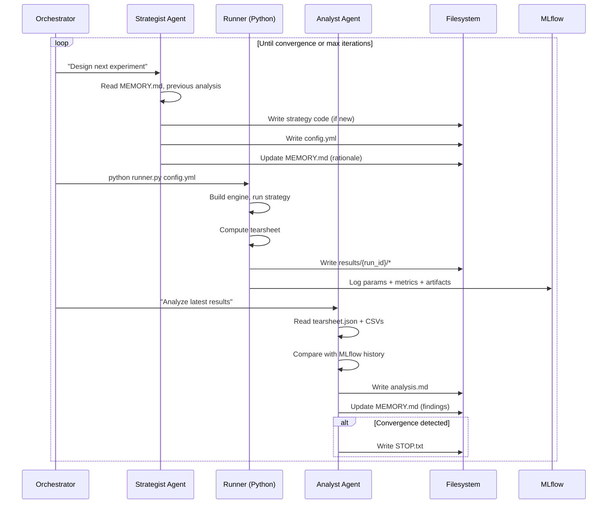

### 6.2 State Contract

```
experiments/
├── config.yml                     # Strategist → Runner
├── strategies/
│   ├── imbalance_v1.py           # Strategist writes
│   └── spread_v1.py
├── universes/
│   └── crypto_hourly.yml         # Universe definitions
├── results/
│   └── {run_id}/
│       ├── orders.csv            # Runner: ReportProvider
│       ├── fills.csv             # Runner: ReportProvider
│       ├── positions.csv         # Runner: ReportProvider
│       ├── account.csv           # Runner: ReportProvider
│       ├── tearsheet.json        # Runner: computed metrics
│       ├── metadata.json         # Runner: config snapshot + timing
│       └── analysis.md           # Analyst: interpretation
├── MEMORY.md                     # All agents: append-only log
├── PROGRESS.md                   # Current state snapshot
└── TODO.md                       # What to do next
```

### 6.3 Convergence Criteria

| Criterion | Threshold | Who Checks |
|-----------|-----------|------------|
| Max iterations | 20 | Orchestrator |
| Wall-clock time | 4 hours | Orchestrator |
| Sharpe plateau | No >0.05 improvement over 5 runs | Analyst |
| Repeated configs | Near-identical params to prior run | Analyst |
| Negative edge | 3 consecutive losing configs | Analyst (recommends pivot) |

---

## 7. Key Design Decisions

| Decision | Choice | Rationale |
|----------|--------|-----------|
| **PMXT access** | Remote stream via fsspec + selective download | 40GB storage limit; HTTP range reads avoid full downloads |
| **Data index** | JSON file (`index.json`) | Simple > database; research playground, not production |
| **Market metadata cache** | JSON files per market | CLI `polymarket clob market` output cached once |
| **Universe format** | YAML with slug glob patterns | Human-readable, agent-writable, version-controllable |
| **MLflow backend** | SQLite | Single server, no Postgres needed |
| **Fee model** | Custom `PolymarketFeeModel` in backtest only | SandboxExecClient hardcodes MakerTakerFeeModel; can't override in paper |
| **Strategy base** | `PolymarketStrategy` extending `Strategy` | Encapsulates limit-order exit, resolution detection, lifecycle management |
| **Instrument construction** | From cached JSON metadata | Backtest has no live API; instruments built from prior CLI fetch |
| **Agent textbook** | Markdown chapters with runnable examples | Agents follow chapters; examples are copy-paste executable |
| **Start with zero-fee markets** | Politics, long-duration crypto | Eliminates fee modeling gap; validates framework first |

---

# Phase 2: Implementation Blocks

All blocks are Python-side. No Rust changes. Ordered by priority from PLAN.md Part II.

---

## Block 1: PMXT Data Loading System

**Priority:** 1 (highest) — everything depends on data
**Effort:** Large
**Depends on:** Nothing

### What This Block Solves

The BacktestEngine needs `OrderBookDelta` / `OrderBookDeltas` objects. PMXT provides raw Parquet with JSON blobs. This block bridges the gap with memory-safe streaming.

### Component Diagram

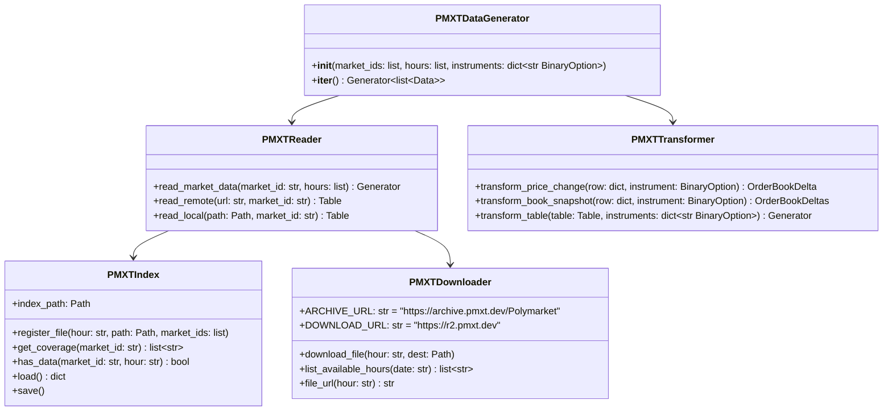

> **Key:** The `instruments` dict in `PMXTTransformer` is keyed by **`token_id`** (decimal string from the JSON `data` blob), not `market_id`. A single `market_id` maps to TWO instruments (Yes token + No token). The transformer parses `token_id` from each row's JSON and dispatches to the correct `BinaryOption`.

### Data Flow

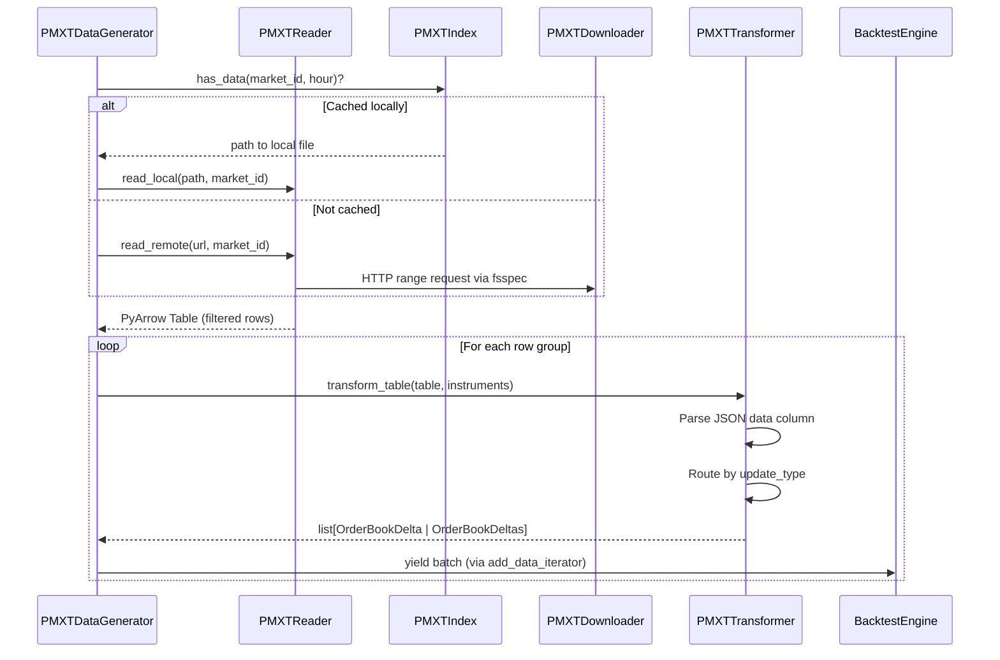

### Memory Safety Design

| Concern | Solution |
|---------|----------|
| 300-700MB parquet files | Read one row group at a time (~1M rows, ~50MB) |
| 13M rows per file, only need 1 market | PyArrow predicate: `market_id IN targets` (row-group-level skip) |
| JSON parsing overhead | Parse `data` column only for matching rows |
| Python object creation | Yield batches of ~1000 deltas; GC between batches |
| Multiple hours of data | Process one hour file at a time via generator |

### Files

| File | Purpose |
|------|---------|
| `agent_pred/pmxt/downloader.py` | HTTP download + fsspec remote read. Uses **two endpoints**: `archive.pmxt.dev` for listing available files, `r2.pmxt.dev` for direct file download/streaming. |
| `agent_pred/pmxt/index.py` | Data index (JSON) — what's cached, coverage |
| `agent_pred/pmxt/reader.py` | Read parquet (local or remote), filter by market_id |
| `agent_pred/pmxt/transformer.py` | PMXT row → OrderBookDelta / OrderBookDeltas |
| `agent_pred/pmxt/generator.py` | Generator for `add_data_iterator()` |
| `agent_pred/pmxt/__init__.py` | Public API: `pmxt_data_generator(market_ids, hours, instruments)` |

### Done Criteria

- [ ] Can download a single PMXT hour file
- [ ] Can read a remote PMXT file via HTTP range requests without full download
- [ ] Can filter rows by market_id with predicate pushdown
- [ ] Can transform `price_change` rows to `OrderBookDelta`
- [ ] Can transform `book_snapshot` rows to `OrderBookDeltas`
- [ ] Can feed transformed data to BacktestEngine via `add_data_iterator()`
- [ ] Data index tracks what's cached and market coverage
- [ ] Memory usage stays under 500MB for a 1-hour file with 1 market

### Integration Test

```
Setup:   Download 1 hour of PMXT data, pick a market with activity
Action:  Run BacktestEngine with PMXT data + trivial strategy (subscribe, log prices)
Assert:  Strategy receives on_order_book_deltas callbacks, book state is valid
```

---

## Block 2: Universe Definition System

**Priority:** 2
**Effort:** Medium
**Depends on:** Block 1 (data availability), Polymarket CLI

### What This Block Solves

Connects: slug patterns → market discovery → instruments → data. Agents specify "I want election markets" and get tradeable instruments with data.

### Resolution Flow

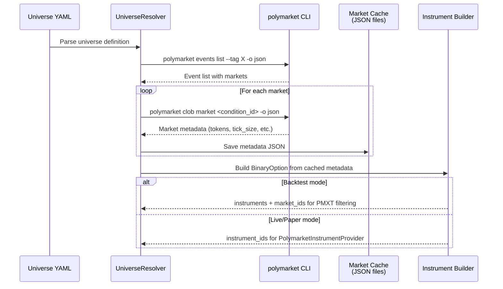

### Reverse Discovery: PMXT → Markets → Instruments

For backtesting, you may start with PMXT files (not slugs). The reverse path discovers what's tradeable in the data you already have:

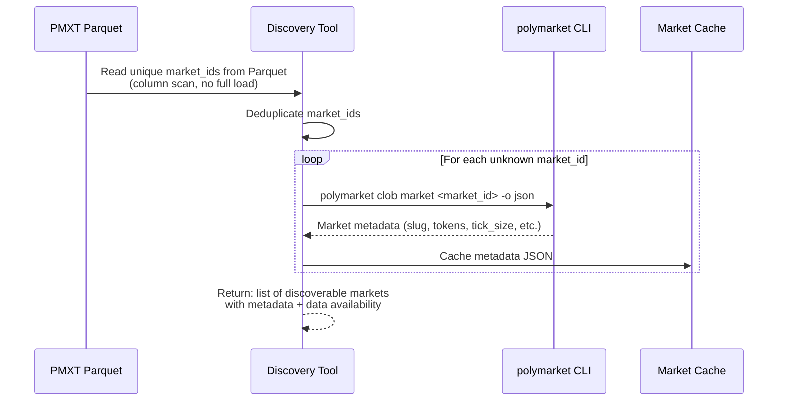

This enables the workflow: "I downloaded this PMXT hour file → what markets are in it → which ones are interesting → build instruments → backtest." The discovery tool reads only the `market_id` column (cheap: string column, predicate-free) and cross-references against the CLI.

### Files

| File | Purpose |
|------|---------|
| `agent_pred/universe/config.py` | Parse universe YAML, validate |
| `agent_pred/universe/resolver.py` | Resolve slug patterns → market metadata via CLI |
| `agent_pred/universe/instruments.py` | Build BinaryOption from cached JSON metadata |
| `agent_pred/universe/cache.py` | Market metadata cache (JSON per market) |
| `agent_pred/universes/*.yml` | Universe definition files |

### Done Criteria

- [ ] Can parse a universe YAML with slug patterns and filters
- [ ] Can resolve slug patterns to condition_ids via CLI
- [ ] Can cache market metadata as JSON
- [ ] Can build BinaryOption instruments from cached metadata
- [ ] Can return instruments + market_ids for PMXT filtering
- [ ] Can generate `load_ids` frozenset for live/paper InstrumentProvider
- [ ] Can discover markets from PMXT file (reverse: data → market_ids → metadata → instruments)

### Integration Test

```
Setup:   Define universe YAML with tag "politics", min_volume 10000
Action:  Resolve universe → get instruments
Assert:  Instruments have valid condition_id, token_id, tick_size, expiration
```

---

## Block 3: Order Book WebSocket Alignment Verification

**Priority:** 3
**Effort:** Small (reduced from original — adapter already handles order book WS)
**Depends on:** Block 1 (PMXT transformer)

### What This Block Solves

The existing adapter already connects to the order book WebSocket. This block **verifies** that PMXT historical data and live WebSocket data produce identical NautilusTrader types, so strategies see the same data in backtest and live.

### Verification Approach

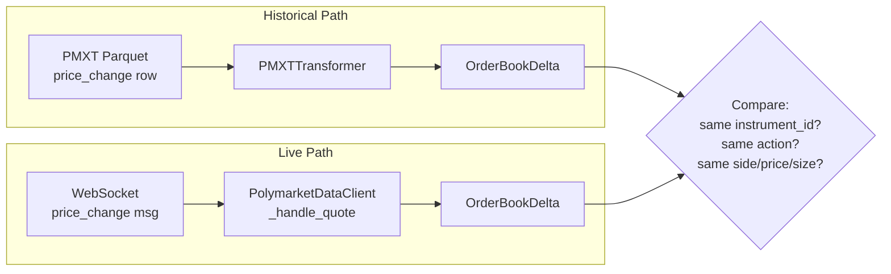

### Specific Alignment Points to Verify

| Field | PMXT Source | WebSocket Source | Expected Match |
|-------|-----------|-----------------|----------------|
| `instrument_id` | market_id + token_id → InstrumentId | Asset subscription → InstrumentId | Must match |
| `BookAction` | change_size=="0" → DELETE, else UPDATE | size=="0" → DELETE, else UPDATE | Must match |
| `BookOrder.side` | change_side ("BUY"/"SELL") | Side from quote direction | Must match |
| `BookOrder.price` | change_price | Price from quote | Must match |
| `BookOrder.size` | change_size | Size from quote | Must match |
| `ts_event` | timestamp (unix seconds → nanos) | Timestamp from msg (millis → nanos) | ±1ms tolerance (see timestamp note) |
| `order_id` | `0` (constant) | `0` (constant) | Both use `0` for L2 data |

### Structural Batching Difference

A critical difference that affects alignment **testing** (not behavior):

| Aspect | PMXT (Historical) | WebSocket (Live) |
|--------|-------------------|------------------|
| **`price_change`** | 1 Parquet row = 1 price change = 1 `OrderBookDelta` | 1 WS message = N price changes (`PolymarketQuotes.price_changes` is a list) = N `OrderBookDelta` objects |
| **`book_snapshot`** | 1 Parquet row = 1 full snapshot = 1 `OrderBookDeltas` (CLEAR + all levels) | 1 WS `book` message = 1 snapshot = 1 `OrderBookDeltas` |

**Implication:** You cannot compare "1 PMXT row" with "1 WS message" directly for `price_change` events. The WS adapter unpacks a list and produces multiple deltas from a single message. For alignment testing, compare individual `OrderBookDelta` objects, not message-level batches.

### Files

| File | Purpose |
|------|---------|
| `agent_pred/tests/test_alignment.py` | Alignment verification tests |
| `agent_pred/docs/data_alignment.md` | Documentation of field mappings |

### Done Criteria

- [ ] Document exact field mapping between PMXT JSON and WebSocket JSON
- [ ] Verify `price_change` → `OrderBookDelta` produces identical output from both paths
- [ ] Verify `book_snapshot` → `OrderBookDeltas` produces identical output
- [ ] Document any differences (timestamp precision, field naming) and how they're handled
- [ ] Strategy receives equivalent callbacks in backtest (PMXT) and paper (WebSocket)

---

## Block 4: Strategy Exit Defaults

**Priority:** 6 (from PLAN.md)
**Effort:** Medium
**Depends on:** Nothing (pure Python, extends NautilusTrader Strategy)

### What This Block Solves

Provides `PolymarketStrategy` base class with safe defaults: limit-order exit (since `close_position()` is broken), resolution timer, price convergence detection. Agents can run experiments quickly without reimplementing exits.

### Lifecycle State Machine

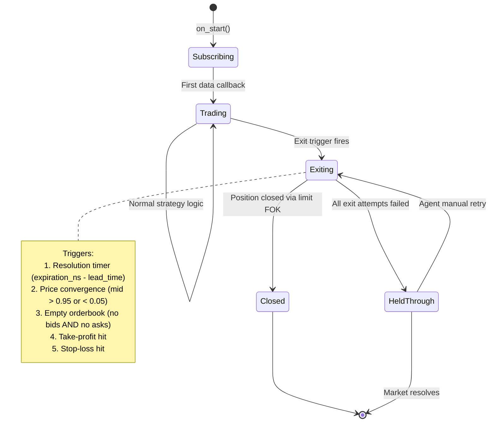

### Exit Sequence

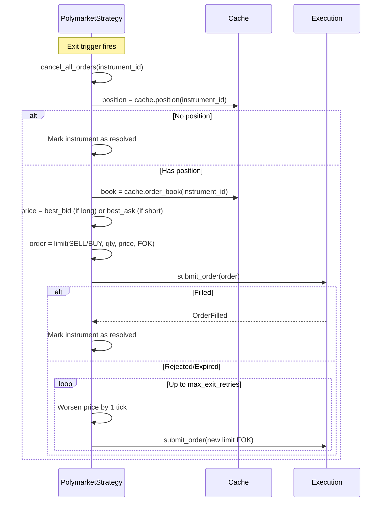

### Default Configuration

| Parameter | Default | Description |
|-----------|---------|-------------|
| `exit_before_resolution_secs` | 300 (5 min) | Timer fires this many seconds before expiration |
| `convergence_threshold` | 0.95 | Exit when mid > threshold or < (1 - threshold) |
| `max_exit_retries` | 3 | FOK retry attempts with worsening price |
| `take_profit` | None (disabled) | Exit when unrealized PnL > threshold |
| `stop_loss` | None (disabled) | Exit when unrealized PnL < threshold |

### HeldThrough Recovery

When all exit attempts fail (e.g., empty order book, insufficient liquidity), the strategy enters `HeldThrough` state. This is NOT silent — the strategy must:

| Action | Description |
|--------|-------------|
| **Log warning** | `self.log.warning(f"HeldThrough: {instrument_id}, position={qty}, failed_exits={count}")` |
| **Set flag** | `self._held_through[instrument_id] = True` — queryable by the runner for the tearsheet |
| **Include in tearsheet** | Runner reports `held_through_instruments: [list]` in metadata.json |
| **Analyst sees it** | Analyst prompt includes: "Check for HeldThrough instruments — these indicate liquidity problems or bad exit timing" |

In **backtest**, HeldThrough means the market resolved while the position was still open. The backtest engine continues — the SimulatedExchange eventually settles at 0 or 1. The tearsheet PnL reflects the unmanaged resolution.

In **paper/live**, HeldThrough means a live unmanaged position exists. The orchestrator can optionally re-trigger an exit attempt on the next iteration (the `HeldThrough → Exiting` transition in the state diagram).

### Polymarket Fee Model

The adapter hardcodes `maker_fee = None`, `taker_fee = None` (`parse.rs:113-114`), so the default `MakerTakerFeeModel` computes zero fees. Hourly crypto markets charge 10% maker + 10% taker — backtests without fee correction are dangerously optimistic.

| Market Category | Maker Fee | Taker Fee | Round-Trip Cost |
|----------------|-----------|-----------|-----------------|
| Hourly crypto (1H) | 1000 bps (10%) | 1000 bps (10%) | ~20% of notional |
| Daily crypto | 1000 bps (10%) | 1000 bps (10%) | ~20% of notional |
| Politics, long-duration | 0 bps | 0 bps | 0% |

Custom `PolymarketFeeModel` subclasses `FeeModel` (`backtest/models/fee.pyx:32`), implements `get_commission(order, fill_qty, fill_px, instrument) → Money`. Passed to `engine.add_venue(fee_model=...)`.

**Paper trading limitation:** `SandboxExecutionClient` hardcodes `MakerTakerFeeModel()` at `sandbox/execution.py:123`. Not configurable. Accept fee inaccuracy in paper; validate in backtest.

### Files

| File | Purpose |
|------|---------|
| `agent_pred/strategies/polymarket_base.py` | PolymarketStrategy base class |
| `agent_pred/strategies/polymarket_fees.py` | PolymarketFeeModel for BacktestEngine |
| `agent_pred/strategies/imbalance.py` | Example: order book imbalance strategy |
| `agent_pred/strategies/spread.py` | Example: spread-based strategy |

### Done Criteria

- [ ] `PolymarketStrategy` base class with limit FOK exit
- [ ] Resolution timer from `instrument.expiration_ns`
- [ ] Price convergence detection (handles `expiration_ns == 0`)
- [ ] Configurable take-profit and stop-loss
- [ ] At least one concrete strategy extending the base
- [ ] Exit works in backtest (verified) and paper (verified)

---

## Block 5: External Historical Data Support

**Priority:** 9
**Effort:** Small
**Depends on:** Nothing

### What This Block Solves

Strategies need auxiliary data beyond price/orderbook: sentiment scores, volatility indices, external signals. This block provides a clean interface for loading timestamped Parquet data into strategy callbacks.

### Design

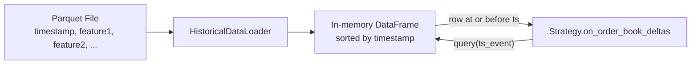

Simple point-in-time lookup: given a timestamp, return the most recent row. No lookahead. Lazy loading (load when first queried).

### Files

| File | Purpose |
|------|---------|
| `agent_pred/data/historical_loader.py` | Load + query Parquet files by timestamp |

### Done Criteria

- [ ] Can load a Parquet file with timestamp + arbitrary columns
- [ ] Can query by timestamp (returns most recent row ≤ query time)
- [ ] No lookahead bias (returns only data available at query time)
- [ ] Works in strategy callbacks during backtest

---

## Block 6: MLflow Infrastructure

**Priority:** 4
**Effort:** Small
**Depends on:** Server access

### What This Block Solves

MLflow tracking server for experiment logging. Must be running before the agentic loop can operate.

### Architecture

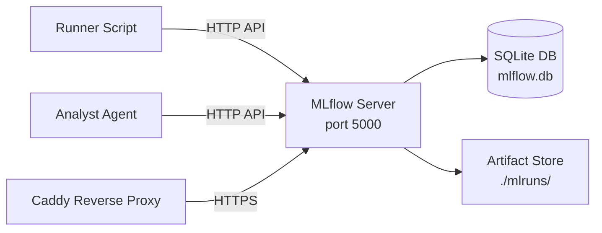

### Setup Tasks

| Task | Command / Action |
|------|-----------------|
| Install MLflow | `pip install mlflow` (in `.venv`) |
| Create systemd service | `mlflow server --backend-store-uri sqlite:///mlflow.db --default-artifact-root ./mlruns --host 0.0.0.0 --port 5000` |
| Configure Caddy | Add `mlflow.{domain}` reverse proxy block |
| Set env var | `MLFLOW_TRACKING_URI=http://localhost:5000` |
| Verify | `mlflow experiments search` returns empty list |

### Files

| File | Purpose |
|------|---------|
| `infra/mlflow/mlflow.service` | systemd unit file |
| `infra/mlflow/Caddyfile.snippet` | Caddy reverse proxy config |

### Done Criteria

- [ ] MLflow server running and accessible
- [ ] SQLite backend configured
- [ ] Caddy proxy configured (HTTPS access)
- [ ] `MLFLOW_TRACKING_URI` set in environment
- [ ] Can create experiment and log a test metric via Python API

---

## Block 7: MLflow Experiment Structure

**Priority:** 5
**Effort:** Medium
**Depends on:** Block 6 (MLflow running)

### What This Block Solves

Defines the mapping from experiment concepts to MLflow hierarchy, and implements the logging interface the runner uses.

### MLflow Mapping

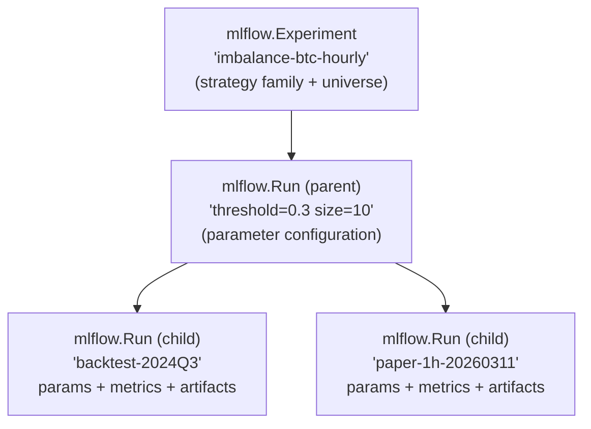

### What Gets Logged

| Category | Fields | MLflow Method |
|----------|--------|--------------|
| **Parameters** | strategy_class, all config params, universe_id, execution_mode | `mlflow.log_params()` |
| **Metrics** | total_pnl, sharpe_ratio, max_drawdown, win_rate, num_trades, profit_factor | `mlflow.log_metrics()` |
| **Artifacts** | orders.csv, fills.csv, positions.csv, tearsheet.json, analysis.md | `mlflow.log_artifacts()` |
| **Tags** | execution_mode, universe_id, agent_iteration | `mlflow.set_tags()` |

### Files

| File | Purpose |
|------|---------|
| `agent_pred/tracking/mlflow_logger.py` | MLflow logging interface for runner |
| `agent_pred/tracking/experiment.py` | Experiment/run naming conventions, hierarchy management |

### Done Criteria

- [ ] Can create experiment from strategy family + universe
- [ ] Can create parent run with parameter configuration
- [ ] Can create child runs for individual executions
- [ ] Runner logs all metrics and artifacts automatically
- [ ] Analyst can query runs by experiment and compare metrics

---

## Block 8: MLflow Live / Paper Logging

**Priority:** 10
**Effort:** Small
**Depends on:** Block 7 (experiment structure)

### What This Block Solves

Paper trading runs are long-lived (minutes to hours). This block adds periodic metric updates to MLflow during live runs, not just final results.

### Design

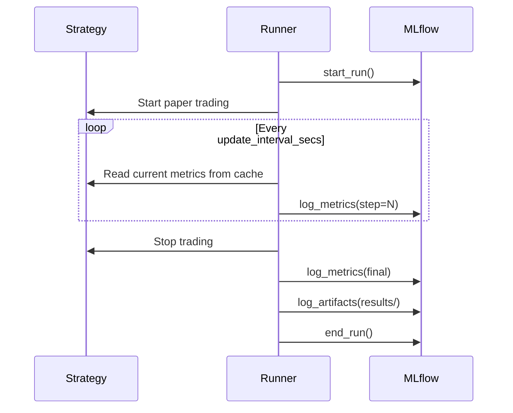

### Files

| File | Purpose |
|------|---------|
| `agent_pred/tracking/live_logger.py` | Periodic metric updater for live/paper runs |

### Done Criteria

- [ ] Metrics update periodically during paper trading
- [ ] Final metrics match tearsheet values
- [ ] Run is tagged as "paper" or "live" (not "backtest")

---

## Block 9: Time-Based Agent Waits

**Priority:** 11
**Effort:** Small
**Depends on:** Block 10b (agent system)

### What This Block Solves

Paper trading runs last minutes to hours. The orchestrator must wait for completion, then trigger analysis — without polling.

### Design

```mermaid
flowchart LR
    ORCH[Orchestrator] -->|"python runner.py config.yml"| RUNNER[Runner Process]
    RUNNER -->|blocks for duration_seconds| RUNNER
    RUNNER -->|exit code 0| ORCH
    ORCH -->|"launch analyst"| ANALYST[Analyst Agent]
```

The runner already blocks for `duration_seconds` in paper mode (via `threading.Timer`). The orchestrator simply waits for the process to exit. No special infrastructure needed.

For long waits (>1 hour), the orchestrator can:
1. Run the runner in background: `python runner.py config.yml &`
2. Record the PID
3. Launch other experiments in parallel
4. Wait for PID completion: `wait $PID`

### Files

| File | Purpose |
|------|---------|
| `agent_pred/orchestrator.sh` | Updated orchestrator with parallel run support |

### Done Criteria

- [ ] Orchestrator waits for runner to complete (blocking)
- [ ] Supports parallel runs (multiple runners in background)
- [ ] Analyst launches only after runner completes

---

## Block 10a: Experiment Runner

**Priority:** 3 (critical path — everything downstream depends on it)
**Effort:** Large
**Depends on:** Block 1 (PMXT data), Block 2 (universe), Block 4 (strategy base), Block 7 (MLflow structure)

### What This Block Solves

The runner is the **central integration point** of the entire system. It reads a config.yml, builds the appropriate NautilusTrader engine (backtest or paper), runs the strategy, generates a tearsheet, and logs to MLflow. It's the deterministic half of the system — no LLM touches it.

### Module Diagram

```mermaid
classDiagram
    class Runner {
        +run(config_path: Path) RunResult
        -_parse_config(path: Path) ExperimentConfig
        -_run_backtest(config: ExperimentConfig) RunResult
        -_run_paper(config: ExperimentConfig) RunResult
        -_build_tearsheet(engine_or_node, config) Tearsheet
        -_log_to_mlflow(result: RunResult)
        -_save_artifacts(result: RunResult, output_dir: Path)
    }

    class ExperimentConfig {
        +mode: str
        +strategy_path: str
        +strategy_config: dict
        +universe_id: str
        +instruments: list
        +data_hours: list
        +mlflow_experiment: str
        +mlflow_parent_run: str
        +duration_seconds: int
        +fee_model: str
    }

    class RunResult {
        +run_id: str
        +config: ExperimentConfig
        +tearsheet: Tearsheet
        +orders_df: DataFrame
        +fills_df: DataFrame
        +positions_df: DataFrame
        +account_df: DataFrame
        +elapsed_seconds: float
        +success: bool
        +error: str or None
    }

    class Tearsheet {
        +total_pnl: float
        +sharpe_ratio: float
        +max_drawdown: float
        +win_rate: float
        +num_trades: int
        +profit_factor: float
        +avg_trade_pnl: float
        +to_dict() dict
    }

    Runner --> ExperimentConfig
    Runner --> RunResult
    RunResult --> Tearsheet
```

### Config.yml Schema

```yaml
# experiments/configs/imbalance_btc_v1.yml
mode: "backtest"                          # "backtest" | "paper"
strategy:
  path: "strategies.imbalance:ImbalanceStrategy"   # importable path
  params:                                 # passed to strategy config
    imbalance_threshold: 0.3
    trade_size: "10.0"
    take_profit: 0.05
    stop_loss: -0.03

universe_id: "crypto-hourly"              # references universes/*.yml

data:                                     # backtest only
  hours: ["2026-03-09T14", "2026-03-09T15"]
  # OR: date_range: {start: "2026-03-09", end: "2026-03-10"}

paper:                                    # paper only
  duration_seconds: 3600

fees: "polymarket"                        # "polymarket" | "zero" | "custom"

mlflow:
  experiment: "imbalance-btc-hourly"
  parent_run: "threshold-0.3-size-10"     # optional
  tags: {iteration: "3", agent: "strategist-v1"}
```

#### Config Validation Rules

| Mode | Required Fields | Forbidden Fields |
|------|----------------|-----------------|
| `backtest` | `data.hours` or `data.date_range` | `paper.duration_seconds` |
| `paper` | `paper.duration_seconds` | `data.hours`, `data.date_range` |

Both modes require: `mode`, `strategy`, `universe_id`, `fees`. The `mlflow` section is optional — if omitted, results are saved locally only.

### Mode-Switched Execution

```mermaid
sequenceDiagram
    participant CFG as config.yml
    participant RUN as Runner
    participant UNI as UniverseResolver
    participant ENG as Engine

    CFG->>RUN: Parse YAML
    RUN->>UNI: Resolve universe_id → instruments + market_ids

    alt mode == "backtest"
        RUN->>RUN: Build BacktestEngine
        RUN->>RUN: add_venue(POLYMARKET, fee_model)
        RUN->>RUN: add_instruments(instruments)
        RUN->>RUN: add_data_iterator(PMXTDataGenerator)
        RUN->>RUN: add_strategy(strategy)
        RUN->>ENG: engine.run()
        ENG-->>RUN: BacktestResult
    else mode == "paper"
        RUN->>RUN: Build TradingNode(SANDBOX config)
        RUN->>RUN: add_strategy + build
        RUN->>RUN: Start threading.Timer(duration_seconds, node.stop)
        RUN->>ENG: node.run()
        Note over ENG: Blocks until Timer fires node.stop()
        ENG-->>RUN: run() returns after stop()
    end

    RUN->>RUN: Build tearsheet from ReportProvider
    RUN->>RUN: Log to MLflow (params + metrics + artifacts)
    RUN->>RUN: Save to results/{run_id}/
```

### Error Handling

| Failure | Runner Behavior |
|---------|----------------|
| Config parse error | Exit code 1 + error in `results/{run_id}/error.json` |
| Strategy import fails | Exit code 1 + error logged |
| PMXT data unavailable | Exit code 2 + list which hours are missing |
| Strategy crashes mid-run | Catch exception, still generate partial tearsheet, exit code 3 |
| MLflow unreachable | Log warning, continue without MLflow, save results locally |
| Paper trading WS disconnects | TradingNode handles reconnection; if persistent, exit code 4 |

Exit codes enable the orchestrator to distinguish failure types and decide whether to retry or skip.

### Files

| File | Purpose |
|------|---------|
| `agent_pred/runner.py` | Main runner: parse config, build engine, execute, report |
| `agent_pred/runner_config.py` | ExperimentConfig dataclass + YAML parsing + validation |
| `agent_pred/tearsheet.py` | Tearsheet computation from ReportProvider DataFrames |

### Done Criteria

- [ ] Runner accepts config.yml, runs backtest, produces tearsheet + artifacts
- [ ] Runner accepts config.yml, runs paper trade for N seconds, produces tearsheet
- [ ] Tearsheet includes all 8 metrics from Section 5.2
- [ ] Results saved to `results/{run_id}/` (orders.csv, fills.csv, positions.csv, tearsheet.json, metadata.json)
- [ ] MLflow logging works (params + metrics + artifacts)
- [ ] Graceful error handling: partial results on strategy crash, local-only on MLflow failure
- [ ] Exit codes distinguish success (0) from different failure modes (1-4)

### Integration Test

```
Setup:   Prepare config.yml pointing to a known PMXT hour + trivial strategy
Action:  python runner.py experiments/configs/test_config.yml
Assert:  results/{run_id}/ exists with tearsheet.json, orders.csv, positions.csv
         tearsheet.json has total_pnl, sharpe_ratio, num_trades
         MLflow has a run with matching metrics
```

---

## Block 10b: Worker / Analyst Agent System

**Priority:** 8
**Effort:** Large
**Depends on:** Block 10a (runner), Block 7 (MLflow structure)

### What This Block Solves

The agentic loop: strategist designs experiments, runner executes (potentially many in parallel), analyst evaluates all results, cycle repeats.

PLAN.md requires: **"Can launch many experiments simultaneously (e.g., 20 at once)"** and **"Workers operate in cycles, not strict chains."** The orchestrator must support a fan-out/fan-in pattern.

### Agent Architecture (Fan-Out / Fan-In)

```mermaid
flowchart TD
    subgraph "Orchestrator (shell script)"
        LOOP{while no STOP.txt<br/>and iteration < max}
    end

    subgraph "Strategist Agent (Claude)"
        S_READ[Read MEMORY.md + previous analysis]
        S_THINK[Generate hypotheses]
        S_WRITE["Write N config files:<br/>config_001.yml<br/>config_002.yml<br/>...<br/>config_020.yml"]
    end

    subgraph "Parallel Execution (no LLM)"
        R1[Runner: config_001.yml]
        R2[Runner: config_002.yml]
        RN[Runner: config_020.yml]
        RDOTS[...]
        WAIT["wait for all PIDs"]
    end

    subgraph "Analyst Agent (Claude)"
        A_READ["Read ALL results:<br/>results/run_001/<br/>results/run_002/<br/>...<br/>+ MLflow comparison"]
        A_INTERPRET[Cross-run analysis]
        A_WRITE[Write analysis.md + MEMORY.md]
        A_CONVERGE{Converged?}
    end

    LOOP --> S_READ
    S_READ --> S_THINK --> S_WRITE
    S_WRITE --> R1 & R2 & RDOTS & RN
    R1 & R2 & RDOTS & RN --> WAIT
    WAIT --> A_READ
    A_READ --> A_INTERPRET --> A_WRITE --> A_CONVERGE
    A_CONVERGE -->|No| LOOP
    A_CONVERGE -->|Yes| STOP[Write STOP.txt]
```

### Orchestrator Fan-Out/Fan-In Logic

```mermaid
sequenceDiagram
    participant O as orchestrator.sh
    participant S as Strategist (Claude)
    participant R as Runner processes
    participant A as Analyst (Claude)

    O->>S: "Design experiments"
    S-->>O: writes configs/ directory with N config files

    Note over O: Fan-out: launch all configs in parallel
    loop For each config file in configs/
        O->>R: python runner.py config_N.yml &
        O->>O: Record PID_N
    end

    Note over O: Fan-in: wait for all
    O->>O: wait ${PIDS[@]}
    O->>O: Collect exit codes

    alt All succeeded (exit 0)
        O->>A: "Analyze all results"
    else Some failed
        O->>A: "Analyze successful results, report failures"
    end

    A-->>O: analysis.md + optional STOP.txt
```

The strategist writes config files to a `configs/` directory. The orchestrator discovers them via glob (`configs/*.yml`), launches one runner per config in background, waits for all, then hands results to the analyst.

### Experiment Variation Support

| Variation | How Strategist Specifies | How Orchestrator Handles |
|-----------|-------------------------|------------------------|
| Parameter sweep (20 backtests) | 20 config files, each with different params | 20 parallel `runner.py` processes |
| Mixed backtest + paper | Some configs have `mode: backtest`, others `mode: paper` | Each runner handles its own mode |
| Different strategies | Different `strategy.path` per config | Each runner imports independently |
| Different universes | Different `universe_id` per config | Each runner resolves independently |
| Sequential (1 config) | Single config file | Single runner, no parallelism |

### Resource Management

With 20 parallel backtests on a constrained server:

| Concern | Mitigation |
|---------|-----------|
| RAM: 20 × PMXT streaming | Each runner streams one hour at a time; peak ~50MB × 20 = ~1GB |
| CPU: 20 × BacktestEngine | Backtest is CPU-bound but single-threaded per engine; OS schedules |
| Disk: 20 × results | ~10MB per run = 200MB total; negligible |
| Network: 20 × remote PMXT reads | fsspec HTTP connections; may need to rate-limit or pre-download |

**If RAM is tight:** The orchestrator can limit parallelism with a semaphore (e.g., `xargs -P 4` or a bash job queue running 4 at a time).

### Agent Prompts

**Strategist** receives:
- System context: textbook chapters, available universes, strategy base class API
- State: MEMORY.md, previous analysis.md, MLflow run history
- Constraints: fee awareness, universe limits, server constraints
- Task: design a **batch** of experiments (not just one) — vary parameters, try multiple strategies
- Output: N config files in `configs/` + optional new strategy files

**Analyst** receives:
- System context: metrics definitions, comparison methodology
- State: ALL tearsheets from the batch, ALL orders.csv/positions.csv, MLflow history
- Task: cross-run comparison, identify best configs, explain what worked/didn't, suggest next direction
- Output: analysis.md + MEMORY.md update + optional STOP.txt

### Files

| File | Purpose |
|------|---------|
| `agent_pred/orchestrator.sh` | Main loop: strategist → parallel runners → analyst |
| `agent_pred/agents/strategist_prompt.md` | System prompt for strategist agent |
| `agent_pred/agents/analyst_prompt.md` | System prompt for analyst agent |

### Done Criteria

- [ ] Orchestrator loop runs: strategist → parallel runners → analyst → repeat
- [ ] Supports batch launching: N configs → N parallel runner processes
- [ ] Supports single config (degenerate case of batch = 1)
- [ ] Handles mixed exit codes (some runners fail, loop continues)
- [ ] Strategist produces valid config.yml files (validated before launch)
- [ ] Analyst reads ALL results from a batch and writes cross-run comparison
- [ ] Convergence detection works (max iterations, Sharpe plateau, repeated configs)
- [ ] STOP.txt terminates the loop
- [ ] Optional parallelism limit (e.g., max 4 concurrent for RAM-constrained runs)

---

## Block 11: Agent Textbook

**Priority:** 7
**Effort:** Medium
**Depends on:** Blocks 1-5 (components the textbook documents)

### What This Block Solves

Agents need a reference for how to use the system. The textbook is a structured guide with runnable examples that agent prompts reference: "Follow Chapter 3 to implement strategy logic."

### Chapter Structure

| Chapter | Title | Covers |
|---------|-------|--------|
| 1 | Data Loading | How to define a universe, download PMXT data, verify coverage |
| 2 | Instrument Construction | How to build BinaryOption instruments from market metadata |
| 3 | Strategy Development | PolymarketStrategy base class, callbacks, limit-order patterns |
| 4 | Running Experiments | config.yml format, runner invocation, results structure |
| 5 | Reading Results | Tearsheet metrics, CSV reports, how to interpret |
| 6 | MLflow Usage | Querying experiments, comparing runs, finding best params |
| 7 | Common Patterns | Fee-aware market selection, exit strategies, universe rotation |

### Requirements

Each chapter includes:
1. **Explanation** — what the component does and why
2. **Interface** — the exact API/config format
3. **Runnable example** — a script that actually executes end-to-end
4. **Gotchas** — common mistakes and how to avoid them

### Files

| File | Purpose |
|------|---------|
| `agent_pred/textbook/ch01_data.md` | Chapter 1: Data Loading |
| `agent_pred/textbook/ch02_instruments.md` | Chapter 2: Instruments |
| `agent_pred/textbook/ch03_strategies.md` | Chapter 3: Strategy Development |
| `agent_pred/textbook/ch04_experiments.md` | Chapter 4: Running Experiments |
| `agent_pred/textbook/ch05_results.md` | Chapter 5: Reading Results |
| `agent_pred/textbook/ch06_mlflow.md` | Chapter 6: MLflow |
| `agent_pred/textbook/ch07_patterns.md` | Chapter 7: Common Patterns |
| `agent_pred/textbook/examples/*.py` | Runnable example scripts |

### Done Criteria

- [ ] All 7 chapters written with explanations, interfaces, examples
- [ ] Every example script runs without modification
- [ ] Agent prompts reference specific chapters
- [ ] Covers all gotchas from PLAN.md (close_position broken, reduce_only broken, fee gaps, etc.)

---

## Block 12: Testing Strategy

**Priority:** 12 (continuous)
**Effort:** Medium (spread across all blocks)
**Depends on:** Each block independently

### What This Block Solves

Verify each component works. Not production-level testing — integration tests that confirm the happy path.

### Test Matrix

| Component | Test | Type |
|-----------|------|------|
| PMXT Download | Download 1 file, verify parquet readable | Integration |
| PMXT Transform | Transform known rows → verify NT types | Unit |
| PMXT Streaming | Feed 1 hour via add_data_iterator → engine runs | Integration |
| Universe Resolve | Resolve slug pattern → get instruments | Integration |
| Instrument Build | Build BinaryOption from cached JSON → valid fields | Unit |
| Strategy Exit | Trigger exit at price convergence → verify limit FOK | Backtest |
| Runner Backtest | Run full backtest → verify tearsheet exists | Integration |
| Runner Paper | Run 30s paper trade → verify tearsheet exists | Integration |
| MLflow Logging | Log params + metrics → query via API | Integration |
| Data Alignment | Compare PMXT delta vs WS delta for same event | Unit |
| Runner Error Handling | Strategy crash → partial tearsheet, exit code 3 | Integration |
| Parallel Launch | 3 configs → 3 parallel runners → all results collected | Integration |

### Files

| File | Purpose |
|------|---------|
| `agent_pred/tests/test_pmxt_download.py` | PMXT download + read |
| `agent_pred/tests/test_pmxt_transform.py` | Row transformation |
| `agent_pred/tests/test_pmxt_integration.py` | End-to-end backtest with PMXT data |
| `agent_pred/tests/test_universe.py` | Universe resolution |
| `agent_pred/tests/test_instruments.py` | BinaryOption construction |
| `agent_pred/tests/test_strategy_exit.py` | Exit mechanism verification |
| `agent_pred/tests/test_runner.py` | Runner end-to-end |
| `agent_pred/tests/test_mlflow.py` | MLflow logging |
| `agent_pred/tests/test_alignment.py` | PMXT ↔ WebSocket alignment |

### Done Criteria

- [ ] All tests pass
- [ ] Each block has at least one integration test
- [ ] Tests run in < 5 minutes total
- [ ] No test requires network access (except PMXT download test, which can be skipped)

---

## Implementation Order

```mermaid
gantt
    title Block Dependencies & Priority Order
    dateFormat X
    axisFormat %s

    section Foundation
    Block 1 PMXT Data Loading     :b1, 0, 4
    Block 2 Universe Definitions  :b2, 2, 3
    Block 6 MLflow Infrastructure :b6, 0, 1

    section Core
    Block 3 WS Alignment          :b3, after b1, 1
    Block 4 Strategy Exits        :b4, 0, 2
    Block 7 MLflow Structure      :b7, after b6, 2

    section Integration
    Block 5 External Data         :b5, 0, 1
    Block 10a Runner              :b10a, after b1, 3

    section Agentic
    Block 8 Live MLflow           :b8, after b7, 1
    Block 10b Agent System        :b10b, after b10a, 3
    Block 11 Textbook             :b11, after b4, 2
    Block 9 Time Waits            :b9, after b10b, 1

    section Continuous
    Block 12 Testing              :b12, 0, 12
```

**Critical path:** Block 1 (PMXT) → Block 10a (Runner) → Block 10b (Agent System)

**Parallel tracks:**
- Track A: Block 1 → Block 3 → (alignment verified) + Block 10a → Block 10b
- Track B: Block 6 → Block 7 → Block 8
- Track C: Block 4 (independent)
- Track D: Block 2 (after Block 1 starts)

> **Note:** Block 10a (Runner) replaces the previous "Runner Script" placeholder. It's the system's central integration point and has its own class diagram, config schema, error handling, and done criteria.

---

## Risk Assessment

| Risk | Severity | Mitigation |
|------|----------|-----------|
| PMXT download fails or schema changes | High | Remote streaming via fsspec as fallback; schema verified 2026-03-11 |
| Memory crash on large parquet | High | Row-group streaming, column pruning, predicate pushdown — never load full file |
| Fee-less backtests overstate profitability | High | Custom PolymarketFeeModel; start on zero-fee markets |
| `close_position()` sends MarketOrder (rejected) | High | PolymarketStrategy base class enforces limit FOK exit |
| WS subscription limit (200 per connection) | Medium | Universe size ≤ 100 instruments (50 markets × 2 tokens) |
| MLflow server unavailable | Medium | Runner continues without logging; logs to local files as fallback |
| Agent loop diverges | Medium | Max iterations, Sharpe plateau, repeated-config detection |
| Slug format changes silently | Medium | Tag-based discovery (events list --tag) as primary; slug builders as convenience |
| Paper trading fee model hardcoded | Low | Accept inaccuracy in paper; validate fees in backtest only |
