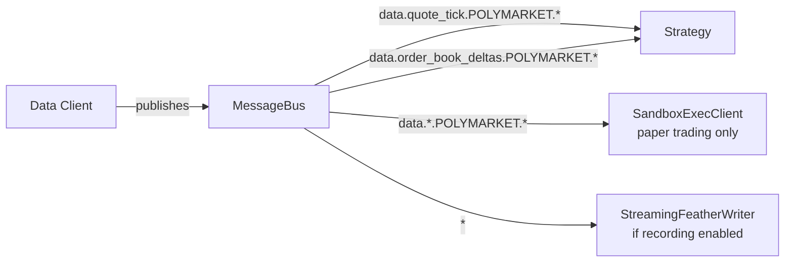
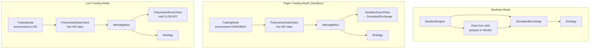
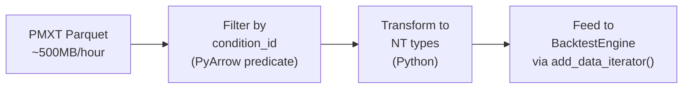
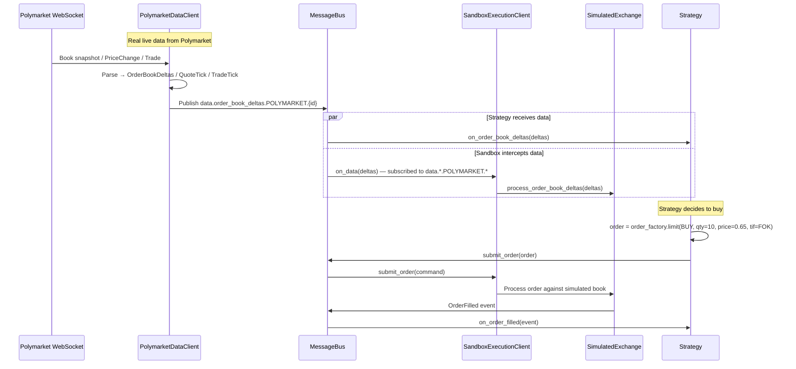
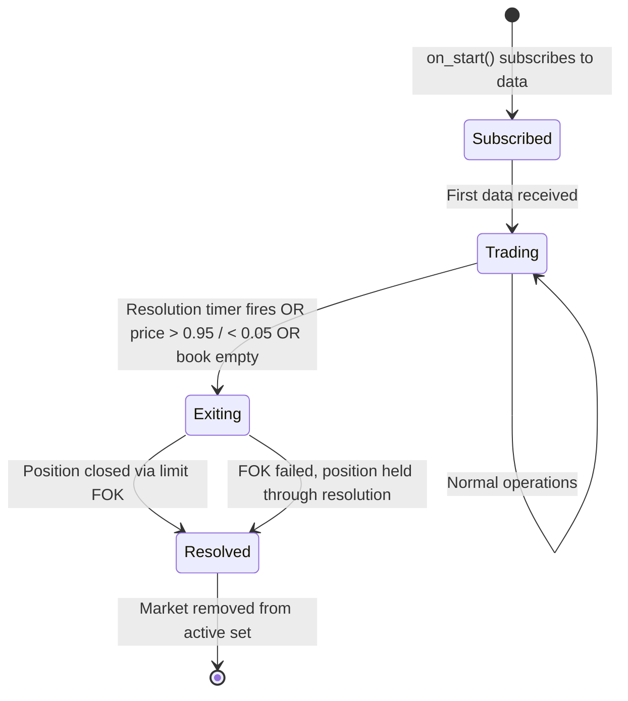
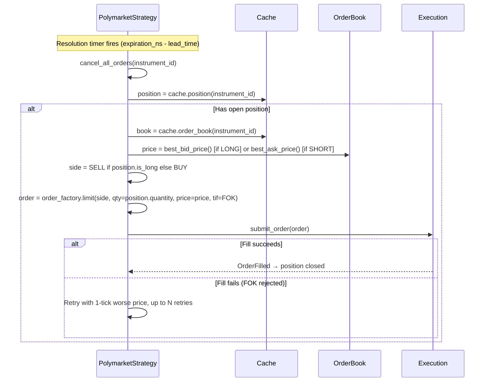
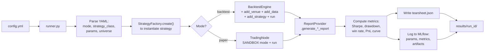
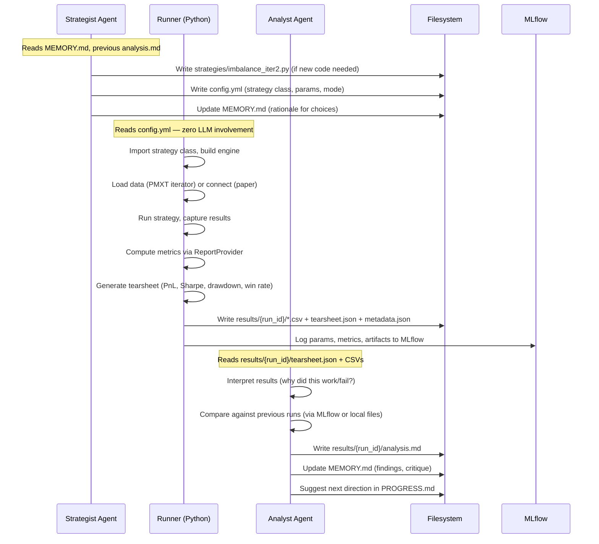

# System Plan: Polymarket Agentic Trading Framework

> **Plan type:** System plan (architecture and behavior)
> **Status:** Draft v3.2
> **Date:** 2026-03-10
> **Base:** Built on PLAN v2.4 (27 code-verified claims, 10 human-reviewed corrections applied, reviewer feedback addressed)

---

## 1. Problem & Scope

We are building a **self-improving research playground** for trading on Polymarket prediction markets, powered by NautilusTrader. The system has two halves:

- **Agentic layer:** LLM agents that design experiments, write strategy code, and analyze results.
- **Deterministic execution layer:** NautilusTrader running strategies in backtest, paper, or live mode with zero LLM involvement.

The critical invariant: **the LLM never touches the hot path.** Agents write code and configs. A deterministic runner script executes them through NautilusTrader, computes metrics, generates tearsheets, and logs everything to MLflow. Agents read the finished reports.

```
┌─────────────────────────────────────────────────────────────────┐
│                    AGENTIC RESEARCH LOOP                        │
│                                                                 │
│  ┌──────────────┐                        ┌────────────────┐    │
│  │  STRATEGIST   │───────────────────────▶│  EXPERIMENT    │    │
│  │  AGENT (LLM)  │                        │  CONFIG        │    │
│  │               │                        │  (strategy.py   │    │
│  │ reads results │                        │   + config.yml) │    │
│  │ + analysis    │                        │                │    │
│  │ writes strat  │                        └───────┬────────┘    │
│  │ code + config │                                │             │
│  └──────▲───────┘                                │             │
│         │                                         ▼             │
│  ┌──────┴───────┐                        ┌───────────────┐     │
│  │  ANALYST      │◀──────results─────────│  RUNNER       │     │
│  │  AGENT (LLM)  │  (tearsheet, metrics,  │  (Python, NO  │     │
│  │               │   MLflow artifacts)    │   LLM)        │     │
│  │ reads finished│                        │               │     │
│  │ tearsheet +   │                        │ runs backtest │     │
│  │ metrics       │                        │ computes PnL, │     │
│  │ interprets    │                        │ Sharpe, etc.  │     │
│  │ proposes next │                        │ logs to MLflow│     │
│  │ experiments   │                        │ writes reports│     │
│  └──────────────┘                        └───────────────┘     │
│                                                                 │
└─────────────────────────────────────────────────────────────────┘
```

### Scope: Two Tiers

| Tier | What it covers |
|------|---------------|
| **v0** | What works today with zero changes — live trading, paper trading, instrument discovery, backtest engine. Warts and all. |
| **v1** | Everything we build — PMXT data transformer, universe management, strategy base classes, market lifecycle handling, experiment runner with automated metrics/tearsheet/MLflow, the agentic loop. All Python-side, no Rust changes. |

### In Scope vs Out of Scope

| In Scope | Out of Scope |
|----------|--------------|
| Orderbook-driven and tick-driven Polymarket strategies | Strategies for non-Polymarket venues |
| Backtest, paper trade, and live trade execution modes | Custom NautilusTrader Rust modifications |
| Universe management (market discovery, filtering, rotation) | Building a new CLOB exchange adapter |
| PMXT historical data transformer for backtesting | Real-time portfolio optimization across venues |
| Experiment identity, logging, and comparison (MLflow) | Training ML models |
| Agentic loop: research → write → run → analyze → iterate | Multi-account or multi-user trading |
| Market lifecycle handling (discovery → trade → resolution) | Continuous live data recording pipeline |

### Key Constraints

| Constraint | What it means | Source |
|-----------|---------------|--------|
| **BinaryOption instruments** | Every Polymarket market is modeled as a BinaryOption with prices from 0.001 to 0.999, quoted in USDC. Each market has two tokens (Yes/No), each becoming a separate instrument. | `crates/adapters/polymarket/src/http/parse.rs:187-188` |
| **Limit orders only** | Polymarket rejects market orders, stop orders, and order modifications. The adapter validates this before sending. Strategies must only use `order_factory.limit()`. | `crates/adapters/polymarket/src/execution/mod.rs:538-547` |
| **`close_position()` is broken** | NautilusTrader's built-in `Strategy.close_position()` creates a MarketOrder internally (`strategy.pyx:1400`), which Polymarket rejects. Strategies **cannot** use `close_position()` or `close_all_positions()`. They must implement their own limit-order exit. | `trading/strategy.pyx:1351-1416` |
| **200 WS subscription limit** | Each WebSocket connection supports max 200 subscriptions. No unsubscribe support. Universe size must respect this. | `crates/adapters/polymarket/src/consts.rs:35` |
| **Fees not populated** | The adapter hardcodes `maker_fee = None`, `taker_fee = None`. Some markets charge 10% fees. All backtest/paper results overestimate profitability on fee-charging markets. | `parse.rs:113-114` |
| **Netting OMS, Cash account** | One position per instrument. No hedging allowed. | `execution/mod.rs:450-451` |

---

## 2. NautilusTrader Primer — How the Engine Works

Before diving into Polymarket-specific design, the reader needs to understand NautilusTrader's core abstractions. This section explains the five concepts that everything else builds on.

### 2.1 What Is NautilusTrader?

NautilusTrader is an open-source algorithmic trading platform written in Rust (core engine) with Python bindings (strategy layer). It provides:

- A **backtesting engine** that replays historical data through your strategy with simulated order matching
- A **live trading node** that connects to real exchanges via adapters
- A **paper trading mode** (called "Sandbox") that feeds live market data but simulates order execution
- The **same strategy code** runs unchanged across all three modes — you write once, test in backtest, validate in paper, deploy to live

The key architectural insight: NautilusTrader separates *data flow* from *execution*. Data always flows the same way (market data → strategy callbacks). Execution is swapped: in backtest it's a simulated exchange, in paper it's a simulated exchange fed by live data, in live it's the real exchange API.

### 2.2 The Strategy Class

Every trading strategy in NautilusTrader is a Python class that extends `Strategy`. You override callback methods that fire when market data arrives:

```python
from nautilus_trader.trading import Strategy
from nautilus_trader.trading.config import StrategyConfig
from nautilus_trader.model.identifiers import InstrumentId
from decimal import Decimal

class MyStrategyConfig(StrategyConfig, frozen=True):
    """Config is a frozen msgspec Struct — all fields must be serializable."""
    instrument_id: InstrumentId
    trade_size: Decimal = Decimal("10.0")
    imbalance_threshold: float = 0.3

class MyStrategy(Strategy):
    def __init__(self, config: MyStrategyConfig) -> None:
        super().__init__(config)
        self.instrument_id = config.instrument_id
        self.trade_size = config.trade_size

    def on_start(self) -> None:
        """Called once when the strategy starts. Subscribe to data here."""
        self.subscribe_order_book_deltas(self.instrument_id)

    def on_order_book_deltas(self, deltas) -> None:
        """Called every time the orderbook changes. Your trading logic goes here."""
        book = self.cache.order_book(self.instrument_id)
        best_bid = book.best_bid_price()
        best_ask = book.best_ask_price()
        # ... compute signal, submit orders ...

    def on_quote_tick(self, tick) -> None:
        """Called on each new quote (bid/ask update)."""
        pass

    def on_trade_tick(self, tick) -> None:
        """Called on each trade that occurs in the market."""
        pass

    def on_order_filled(self, event) -> None:
        """Called when one of YOUR orders gets filled."""
        self.log.info(f"Filled: {event}")

    def on_stop(self) -> None:
        """Called when the strategy shuts down. Clean up here."""
        self.cancel_all_orders(self.instrument_id)
```

**Key points for newcomers:**
- `StrategyConfig` is a frozen (immutable) struct. Every field must be serializable — this is how agents will parameterize experiments.
- `on_start()` is where you subscribe to data feeds. The engine doesn't send you data until you ask for it.
- `self.cache` gives you access to current state: orderbooks, positions, orders, account balances.
- `self.order_factory` creates order objects. For Polymarket, always use `self.order_factory.limit()`.
- The same class runs in backtest, paper, and live. The engine handles the plumbing.

**Library freedom:** Strategies are plain Python — you can import any library (`numpy`, `pandas`, `sklearn`, `torch`, `polars`, etc). No sandboxing, no restrictions. Your strategy's callback methods (`on_order_book_deltas`, `on_trade_tick`, etc.) are normal Python methods — you can do whatever you want inside them, including calling ML models, computing features, logging to external services, or reading files. The only consideration is handler latency: in live/paper mode, a slow handler falls behind the data stream. In backtesting this doesn't matter (it's synchronous replay).

### 2.3 The Instrument

An "instrument" in NautilusTrader is any tradeable asset — a stock, future, option, or in our case, a **BinaryOption**. Each Polymarket market produces two instruments (Yes token and No token).

```python
# A Polymarket BinaryOption instrument has these key properties:
instrument.id            # InstrumentId: "0x<condition_id>-<token_id_decimal>.POLYMARKET"
instrument.price_increment  # Price: 0.001 (or 0.01 for some markets)
instrument.size_increment   # Quantity: 0.000001 (USDC.e precision)
instrument.expiration_ns    # int: UNIX nanoseconds when market expires (0 if no end_date)
instrument.info             # dict: {"token_id": "...", "condition_id": "...", "outcome": "Yes",
                            #        "market_slug": "...", "neg_risk": False, ...}
instrument.currency         # Currency: USDC

# Use instrument methods for safe price/quantity construction:
price = instrument.make_price(0.65)   # Respects tick size
qty = instrument.make_qty(10.0)       # Respects size precision
```

The `instrument.info` dict is important — it contains Polymarket-specific metadata (token_id, condition_id, outcome, market_slug, neg_risk). This dict is preserved through serialization, so backtest instruments loaded from recorded data retain all metadata.
Source: `serialization/arrow/implementations/instruments.py:85` (BinaryOption schema includes `info: pa.binary()`), lines 441-471 (encode/decode via msgspec).

### 2.4 The MessageBus

NautilusTrader uses a publish/subscribe message bus internally. Understanding this is key to understanding paper trading:



When you call `self.subscribe_order_book_deltas(instrument_id)` in your strategy, it registers a subscription on the bus. The data client publishes to `data.order_book_deltas.POLYMARKET.{instrument_id}`, and the bus routes it to your `on_order_book_deltas()` callback.

This matters because:
- **Paper trading** works by having the SandboxExecutionClient subscribe to `data.*.POLYMARKET.*` — it intercepts all market data and feeds it to a simulated exchange for order matching.
- **Data recording** works by having a StreamingFeatherWriter subscribe to `*` — it captures everything and writes it to disk.

### 2.5 Execution Modes



| Aspect | Backtest | Paper (Sandbox) | Live |
|--------|----------|-----------------|------|
| Data source | Historical data from parquet/iterator | Live Polymarket WebSocket | Live Polymarket WebSocket |
| Order execution | SimulatedExchange (in-process) | SimulatedExchange (in-process, fed live data) | Polymarket CLOB API (real orders) |
| Strategy code | **Identical** | **Identical** | **Identical** |
| Risk | None (historical replay) | None (simulated fills) | Real money |
| Config object | `BacktestEngineConfig` | `TradingNodeConfig(environment=SANDBOX)` | `TradingNodeConfig(environment=LIVE)` |

---

## 3. PMXT Data — The Backtesting Lifeline

### 3.1 Why This Section Matters Most

NautilusTrader can backtest any data you give it. But by default, the Polymarket adapter only provides **live** data via WebSocket — there is no built-in historical data endpoint. Without historical data, you cannot backtest. Without backtesting, the agentic loop cannot iterate quickly (each experiment takes real wall-clock time in paper trading).

**PMXT flat file dumps** are our path to historical backtesting: hourly Parquet files of all Polymarket orderbook/trade data from an external source. We must build a transformer that converts PMXT's schema into NautilusTrader types — this is v1 work and the critical unblock for the entire research playground.

> NautilusTrader also supports recording live data via `StreamingConfig` for later replay (feather → parquet conversion), but that's a separate concern for production infrastructure, not our research playground. Our focus is PMXT historical dumps.

### 3.2 What PMXT Provides

PMXT provides **hourly Parquet dumps of all Polymarket orderbook and trade data**:

- **Files:** `polymarket_orderbook_YYYY-MM-DDTHH.parquet` (one file per hour)
- **Size:** 300–700 MB per hour (~12 GB per day)
- **Coverage:** ALL active Polymarket markets in each file
- **Format:** Standard Apache Parquet (columnar format)
- **Content:** Orderbook snapshots and trades, keyed by condition_id/token_id
- **Updated:** Hourly, freely available

### 3.3 The Core Engineering Problem

NautilusTrader's BacktestEngine expects data in its own internal types. Here's what the engine accepts:

| NautilusTrader Type | What It Represents | How to Add It |
|--------------------|--------------------|---------------|
| `OrderBookDelta` | A single orderbook level change (add/update/delete at a price level) | `engine.add_data([delta1, ...])` or `engine.add_data_iterator(...)` |
| `OrderBookDeltas` | A batch of deltas (snapshot or incremental update) | `engine.add_data([deltas1, ...])` or `engine.add_data_iterator(...)` |
| `TradeTick` | A single trade execution (price, size, aggressor side) | `engine.add_data([tick1, ...])` |
| `QuoteTick` | A bid/ask quote update (best bid price/size, best ask price/size) | `engine.add_data([quote1, ...])` |
| `Bar` | An OHLCV candle | `engine.add_data([bar1, ...])` |

PMXT provides raw Polymarket data in its own schema. **We must transform PMXT data → NautilusTrader types.**

**Two ways to feed data into the BacktestEngine:**

| Method | When to use | How it works |
|--------|-------------|-------------|
| `engine.add_data(list)` | Small datasets that fit in memory | Pass a Python list of data objects. Engine validates `instrument_id` against cache, sorts by `ts_init`, stores in memory. |
| `engine.add_data_iterator(name, generator)` | Large datasets like PMXT (~12 GB/day) | Pass a Python generator that yields `list[Data]` chunks. Engine processes each batch lazily — no need to load everything into memory. |

Source: `nautilus_trader/backtest/engine.pyx:860-950`

**`add_data_iterator()` is the right choice for PMXT.** At 12 GB/day, loading everything into memory as Python objects is impractical. The iterator API lets us stream PMXT parquet files one at a time:

```python
from nautilus_trader.model.identifiers import ClientId

def pmxt_data_generator(parquet_files, condition_id, instrument):
    """Stream PMXT data without loading everything into memory."""
    for parquet_file in sorted(parquet_files):
        table = pq.read_table(parquet_file,
            filters=[("condition_id", "==", condition_id)])
        deltas = [pmxt_row_to_delta(row, instrument) for row in table.to_pylist()]
        yield deltas  # list[OrderBookDelta], sorted by ts_init

engine.add_data_iterator(
    data_name="polymarket_orderbook",
    generator=pmxt_data_generator(files, cid, instrument),
    client_id=ClientId("POLYMARKET"),
)
```

Key details about `add_data_iterator()`:
- Generator yields batches; engine processes each batch then asks for the next — lazy evaluation
- Data must be sorted by `ts_init` within each yielded batch
- Unlike `add_data()`, this does NOT validate `instrument_id` against cache — you must still call `add_instrument()` first, but the data itself streams lazily
- Source: `engine.pyx:920-950`

### 3.4 PMXT Schema Mapping (Requires Investigation)

> **STATUS: We have not yet downloaded or inspected PMXT Parquet files.** The exact schema is unknown. What follows is the best mapping we can design based on known Polymarket data structures (verified via `polymarket` CLI).

**Known Polymarket orderbook structure** (from `polymarket clob book <token_id>`, verified via CLI):

```json
{
  "asks": [{"price": "0.999", "size": "10055.7"}, {"price": "0.998", "size": "2010.63"}],
  "bids": [{"price": "0.007", "size": "100"}, {"price": "0.006", "size": "500"}],
  "asset_id": "75467129615908319583031474642658885479135630431889036121812713428992454630178",
  "market": "0xb48621f7eba07b0a3eeabc6afb09ae42490239903997b9d412b0f69aeb040c8b",
  "last_trade_price": "0.113",
  "min_order_size": "5",
  "neg_risk": false,
  "tick_size": "0.001",
  "timestamp": "2026-03-09T04:19:38.241+00:00"
}
```

| Field | Type | Notes |
|-------|------|-------|
| `asks` / `bids` | Array of `{price, size}` | Both values are strings |
| `asset_id` | String | Token ID as **decimal integer** (not hex) |
| `market` | String | Condition ID (hex `0x...`) |
| `last_trade_price` | String | Most recent trade price |
| `min_order_size` | String | Minimum order size for this market |
| `neg_risk` | Boolean | Whether this is a negative-risk market |
| `tick_size` | String | Minimum price increment |
| `timestamp` | String | **ISO 8601** with milliseconds and UTC offset (not unix seconds) |

**Target NautilusTrader types and their required fields:**

```python
# OrderBookDelta — one level change
OrderBookDelta(
    instrument_id=InstrumentId,   # Maps from: condition_id + token_id
    action=BookAction,            # ADD, UPDATE, DELETE, or CLEAR
    order=BookOrder(
        side=OrderSide,           # BUY (bid) or SELL (ask)
        price=Price,              # Maps from: price string → Price
        size=Quantity,            # Maps from: size string → Quantity
        order_id=uint64,          # Synthetic: hash of price level
    ),
    flags=uint8,                  # F_SNAPSHOT for full snapshots
    sequence=uint64,              # Monotonic sequence number
    ts_event=uint64,              # Maps from: timestamp → nanoseconds
    ts_init=uint64,               # Same as ts_event for historical data
)

# TradeTick — one trade
TradeTick(
    instrument_id=InstrumentId,   # Maps from: condition_id + token_id
    price=Price,                  # Maps from: trade price
    size=Quantity,                # Maps from: trade size
    aggressor_side=AggressorSide, # BUYER or SELLER
    trade_id=TradeId,             # Maps from: transaction hash or synthetic
    ts_event=uint64,              # Maps from: timestamp → nanoseconds
    ts_init=uint64,
)
```

**The PMXT pipeline we build (v1):**



**Step 1: Filter** — PMXT files contain ALL markets. We only want specific condition_ids. PyArrow's predicate pushdown lets us filter without loading the entire file into memory:

```python
import pyarrow.parquet as pq

# Read only rows for our target markets
table = pq.read_table(
    "polymarket_orderbook_2026-03-09T14.parquet",
    filters=[("condition_id", "in", target_condition_ids)],
)
```

**Step 2: Transform** — Convert PMXT rows to NautilusTrader types. The exact implementation depends on the PMXT schema (which we haven't inspected yet), but the pattern will be:

```python
from nautilus_trader.model.data import OrderBookDelta, TradeTick
from nautilus_trader.model.objects import Price, Quantity
from nautilus_trader.model.enums import BookAction, OrderSide, AggressorSide

def pmxt_row_to_delta(row, instrument) -> OrderBookDelta:
    """Convert one PMXT orderbook row to an OrderBookDelta."""
    return OrderBookDelta(
        instrument_id=instrument.id,
        action=BookAction.ADD,  # For snapshots; UPDATE for incrementals
        order=BookOrder(
            side=OrderSide.BUY if row["side"] == "bid" else OrderSide.SELL,
            price=instrument.make_price(float(row["price"])),
            size=instrument.make_qty(float(row["size"])),
            order_id=hash(f"{row['price']}_{row['side']}") & 0xFFFFFFFFFFFFFFFF,
        ),
        flags=0,
        sequence=row.get("sequence", 0),
        ts_event=int(row["timestamp"]) * 1_000_000_000,  # seconds → nanoseconds
        ts_init=int(row["timestamp"]) * 1_000_000_000,
    )
```

**Step 3: Feed to BacktestEngine** — Use `add_data_iterator()` to stream transformed data lazily (see Section 3.3 above for the generator pattern). For small datasets, `add_data()` with a list works too.

### 3.5 PMXT Data: What We Know vs What We Must Investigate

| Known | Unknown (must investigate) |
|-------|---------------------------|
| Files are hourly Parquet, ~500MB each | Exact column names and types |
| Keyed by condition_id/token_id | Whether data is snapshots, deltas, or both |
| Contains orderbook and trade data | How trades are distinguished from book entries |
| Freely available | Download URL / access method |
| Covers all active markets | Whether historical backfill is available |

**First task before any PMXT integration:** Download one PMXT file, inspect its schema with `pq.read_schema()`, and document the exact column mapping. Everything else in this pipeline depends on knowing the schema.

---

## 4. Required Capabilities

This section covers each capability using the EXISTS/BUILD format. For each: what NautilusTrader provides today (v0), and what we must build (v1).

### 4.1 Backtesting

**What backtesting means in NautilusTrader:** The BacktestEngine replays historical market data through your strategy, simulating order execution against a virtual exchange. It processes data in timestamp order, updating the simulated exchange's orderbook, matching your orders against it, and calling your strategy callbacks. The result is a full trade history: every order, fill, and position, with PnL calculations.

#### EXISTS TODAY (v0)

NautilusTrader's BacktestEngine is fully functional. Here's the complete API for running a backtest:

```python
from nautilus_trader.backtest.engine import BacktestEngine
from nautilus_trader.backtest.config import BacktestEngineConfig
from nautilus_trader.config import LoggingConfig
from nautilus_trader.model.enums import AccountType, OmsType, BookType
from nautilus_trader.model.objects import Money
from nautilus_trader.model.currencies import USDC
from nautilus_trader.model.identifiers import Venue, TraderId
from decimal import Decimal

# 1. Create engine with config
config = BacktestEngineConfig(
    trader_id=TraderId("BACKTESTER-001"),
    logging=LoggingConfig(log_level="INFO"),
)
engine = BacktestEngine(config=config)

# 2. Add a venue — this creates a SimulatedExchange inside the engine.
#    The SimulatedExchange maintains an orderbook and matches your orders.
#    Note: The adapter exports two constants from adapters.polymarket:
#      - POLYMARKET (str) — used as dict key in data_clients/exec_clients config
#      - POLYMARKET_VENUE (Venue) — used for engine.add_venue(), cache lookups
#    You can import POLYMARKET_VENUE instead of creating Venue("POLYMARKET") manually.
POLYMARKET = Venue("POLYMARKET")
engine.add_venue(
    venue=POLYMARKET,
    oms_type=OmsType.NETTING,       # One position per instrument (Polymarket requirement)
    account_type=AccountType.CASH,   # Cash account, no margin
    starting_balances=[Money(10_000, USDC)],
    book_type=BookType.L2_MBP,       # L2 orderbook (multiple price levels)
    reject_stop_orders=True,         # Polymarket doesn't support stops
)

# 3. Add instruments — the BinaryOption objects for the markets you're backtesting.
#    These must be loaded from somewhere (catalog, or manually constructed).
engine.add_instrument(yes_instrument)
engine.add_instrument(no_instrument)

# 4. Add data — the historical market data to replay.
#    Data must be NautilusTrader types: OrderBookDelta, TradeTick, QuoteTick, Bar.
engine.add_data(orderbook_deltas)   # list[OrderBookDelta]
engine.add_data(trade_ticks)        # list[TradeTick]

# 5. Add your strategy
strategy = MyStrategy(config=MyStrategyConfig(
    instrument_id=yes_instrument.id,
    trade_size=Decimal("10.0"),
))
engine.add_strategy(strategy)

# 6. Run the backtest
engine.run()

# 7. Get results
result = engine.get_result()
print(f"Total PnL: {result.stats_pnls}")
print(f"Total orders: {result.total_orders}")
print(f"Total positions: {result.total_positions}")

# Detailed reports as pandas DataFrames (via ReportProvider):
from nautilus_trader.analysis.reporter import ReportProvider
reporter = ReportProvider()
orders = list(engine.trader.cache.orders())
positions = list(engine.trader.cache.positions())
orders_df = reporter.generate_order_fills_report(orders)
positions_df = reporter.generate_positions_report(positions)
account_df = reporter.generate_account_report(engine.trader.cache.account_for_venue(POLYMARKET))

# 8. Clean up
engine.dispose()
```

**How instruments and data are connected:** They're linked implicitly via the `instrument_id` field on each data object. When you call `add_data(data)`, the engine inspects the first element:

1. If the data has an `instrument_id` attribute (`OrderBookDelta`, `TradeTick`, `QuoteTick`), the engine validates that this `instrument_id` already exists in the cache — **you MUST call `add_instrument()` first**, or `add_data()` raises an error.
2. If the data is a `Bar`, the engine checks `bar_type.instrument_id` against the cache.
3. All data goes into one sorted list. At runtime, when a strategy calls `subscribe_book_deltas(instrument_id=X)`, the engine registers subscription name `OrderBookDelta.X`, and the message bus routes matching events to the strategy's `on_order_book_deltas()` handler.

**The connection is: (1) add instrument first, (2) add data second, (3) they're linked by `instrument_id` on the data objects, (4) the message bus routes data to strategy handlers based on subscriptions.**

Source: `engine.pyx:860-918` — validation logic, `engine.pyx:907-914` — subscription name registration.

**For large datasets, use `add_data_iterator()`:**

```python
from nautilus_trader.model.identifiers import ClientId

# Process data lazily via generator instead of loading everything into memory
def data_generator(parquet_files, condition_id, instrument):
    """Yield batches of OrderBookDelta from PMXT parquet files."""
    for pf in sorted(parquet_files):
        table = pq.read_table(pf, filters=[("condition_id", "==", condition_id)])
        deltas = [pmxt_row_to_delta(row, instrument) for row in table.to_pylist()]
        yield deltas  # list[OrderBookDelta], must be sorted by ts_init

engine.add_data_iterator(
    data_name="polymarket_orderbook",
    generator=data_generator(files, cid, instrument),
    client_id=ClientId("POLYMARKET"),
)
```

Use `add_data()` for small datasets (fits in memory). Use `add_data_iterator()` for large datasets like PMXT (~12 GB/day). The iterator yields batches lazily — the engine processes one batch, then asks the generator for the next.

Source: `engine.pyx:920-950`

**Instruments without data are inert:** You can safely add more instruments than you have data for. The BacktestEngine is entirely data-driven — it replays events from a sorted data stream chronologically. If you add an instrument but no data for it, that instrument simply never generates events. The strategy's handlers are never called for it. No error, no warning, no overhead. This means you can define a broad universe of instruments and let the data availability determine which ones are actually active in the backtest.

Source: `engine.pyx:1300-1364`, `data_iterator.rs:80-106` — the engine iterates over the data stream (a priority queue / binary heap), not over instruments.

**Key `add_venue()` parameters explained:**

| Parameter | What it does | Polymarket setting |
|-----------|-------------|-------------------|
| `oms_type` | NETTING = one position per instrument, HEDGING = separate positions | NETTING |
| `account_type` | CASH = no leverage, MARGIN = with leverage | CASH |
| `starting_balances` | Initial account balance for simulation | `[Money(10_000, USDC)]` |
| `book_type` | L1_MBP = best bid/ask only, L2_MBP = full orderbook | L2_MBP |
| `fill_model` | How orders are filled. Default: 100% fill at resting price | `FillModel(prob_fill_on_limit=0.8)` for realism |
| `fee_model` | Fee structure. Default: `MakerTakerFeeModel()` (uses `instrument.maker_fee`/`taker_fee`, but Polymarket hardcodes these as `None` → 0% fees) | `PolymarketFeeModel(maker_fee_bps=1000, taker_fee_bps=1000)` for fee-charging markets (see Block 7) |
| `trade_execution` | Whether trade ticks update the simulated market | True |
| `reject_stop_orders` | Reject stop orders (Polymarket doesn't support them) | True |

> This table shows the most relevant parameters for Polymarket. `add_venue()` has ~20 parameters total including `use_reduce_only`, `use_position_ids`, `use_random_ids`, `queue_position`, `allow_cash_borrowing`, `liquidity_consumption`, etc. See `engine.add_venue()` docstring for the full list.

Source: `nautilus_trader/backtest/engine.pyx`

**What exists:**
- BacktestEngine with SimulatedExchange, full order matching
- Configurable fill models (deterministic, probabilistic, partial fill, etc.)
- Configurable fee models (maker/taker, fixed, per-contract)
- `add_data_iterator()` for streaming large datasets lazily
- Report generation (orders, fills, positions, account) as pandas DataFrames
- BacktestResult with PnL stats, return stats, timing info

**Limitations:**
- No historical Polymarket data comes with NautilusTrader. You must supply it.
- The engine accepts data — it doesn't fetch it.

#### WE MUST BUILD (v1)

1. **PMXT data transformer** (medium effort) — Python module that reads PMXT Parquet files, filters by condition_id, and converts rows to `OrderBookDelta` / `TradeTick` objects. Feeds them to the engine via `add_data_iterator()`. Depends on PMXT schema investigation.

2. **Backtest runner script** (medium effort) — Python module that reads a `config.yml` (strategy class, parameters, instrument IDs, data path) and programmatically constructs a BacktestEngine, runs it, computes metrics via `ReportProvider`, generates a standardized tearsheet, logs to MLflow, and writes structured results to disk. This is the "Runner" in the agentic loop.

3. **Fee model override** (small effort) — Custom `FeeModel` that applies Polymarket's actual fees (0% for politics/long-duration, 10% maker+taker for hourly crypto). Pass to `engine.add_venue(fee_model=...)`.

### 4.2 Paper Trading

**What paper trading means in NautilusTrader:** Your strategy receives **real, live** market data from Polymarket's WebSocket feed — real orderbook changes, real trades happening on the exchange right now. But when your strategy submits an order, instead of going to Polymarket's CLOB, the order goes to a `SimulatedExchange` running inside your process. This simulated exchange maintains its own copy of the orderbook (updated from the live feed) and matches your orders against it. You see realistic fills without risking real money.

#### EXISTS TODAY (v0)

Paper trading works today with zero code changes. Here's the complete setup:

```python
from decimal import Decimal
from nautilus_trader.adapters.polymarket import POLYMARKET
from nautilus_trader.adapters.polymarket import PolymarketDataClientConfig
from nautilus_trader.adapters.polymarket import PolymarketLiveDataClientFactory
from nautilus_trader.adapters.polymarket.providers import PolymarketInstrumentProviderConfig
from nautilus_trader.adapters.sandbox.config import SandboxExecutionClientConfig
from nautilus_trader.adapters.sandbox.factory import SandboxLiveExecClientFactory
from nautilus_trader.common import Environment
from nautilus_trader.config import TradingNodeConfig, LoggingConfig
from nautilus_trader.live.node import TradingNode
from nautilus_trader.model.identifiers import TraderId, InstrumentId
from nautilus_trader.model.currencies import USDC

# Define which markets to trade (by condition_id + token_id)
condition_id = "0xcccb7e7613a087c132b69cbf3a02bece3fdcb824c1da54ae79acc8d4a562d902"
token_id = "8441400852834915183759801017793514978104486628517653995211751018945988243154"

instrument_config = PolymarketInstrumentProviderConfig(
    load_ids=frozenset([f"{condition_id}-{token_id}"]),
)

# Configure the TradingNode
config = TradingNodeConfig(
    trader_id=TraderId("PAPER-001"),
    logging=LoggingConfig(log_level="INFO"),
    data_clients={
        POLYMARKET: PolymarketDataClientConfig(
            instrument_config=instrument_config,
            # No API keys needed for data-only (public WebSocket)
            # But keys are needed if you also want execution reconciliation
        ),
    },
    exec_clients={
        POLYMARKET: SandboxExecutionClientConfig(
            venue="POLYMARKET",
            starting_balances=["10_000 USDC"],
            account_type="CASH",
            oms_type="NETTING",
            book_type="L2_MBP",   # Feed live orderbook to SimulatedExchange
        ),
    },
)

# Build and run
node = TradingNode(config=config)

strategy = MyStrategy(config=MyStrategyConfig(
    instrument_id=InstrumentId.from_str(f"{condition_id}-{token_id}.POLYMARKET"),
    trade_size=Decimal("10.0"),
))
node.trader.add_strategy(strategy)

node.add_data_client_factory(POLYMARKET, PolymarketLiveDataClientFactory)
node.add_exec_client_factory(POLYMARKET, SandboxLiveExecClientFactory)
node.build()

try:
    node.run()    # Blocking — runs until Ctrl+C
finally:
    node.dispose()
```

**How it works internally:**



**Key detail:** The `SandboxExecutionClient` subscribes to `data.*.{venue}.*` on the MessageBus during `connect()` (line 148 of `sandbox/execution.py`). Its `on_data()` method examines the data type and routes to the appropriate `SimulatedExchange.process_*()` method:

- `OrderBookDelta` → `exchange.process_order_book_delta(data)`
- `OrderBookDeltas` → `exchange.process_order_book_deltas(data)`
- `QuoteTick` → `exchange.process_quote_tick(data)`
- `TradeTick` → `exchange.process_trade_tick(data)`
- `Bar` → `exchange.process_bar(data)`

Source: `nautilus_trader/adapters/sandbox/execution.py:195-225`

**What exists:**
- Full paper trading with live Polymarket data
- SimulatedExchange that maintains orderbook and matches limit orders
- Support for L2 orderbook data in the simulated exchange
- Configurable fill models and fee models on the sandbox exchange

**Limitations:**
- SimulatedExchange simulates a generic CLOB. It doesn't model Polymarket-specific behaviors (market maker rewards, resolution mechanics).
- Fees are not automatically populated (adapter hardcodes `None`). You must configure a FeeModel on the SandboxExecutionClientConfig or accept that profitability is overstated.
- The `SandboxExecutionClient` creates a generic `InstrumentProvider()` (line 99) — it relies on instruments already being in the cache. The PolymarketDataClient loads instruments first during `TradingNode.build()`, so this works.

#### WE MUST BUILD (v1)

1. **PolymarketStrategy base class** (medium effort) — Abstract base class extending `Strategy` with:
   - `close_position_limit()` method: exits positions using limit FOK orders instead of the broken `close_position()` / `close_all_positions()`
   - Resolution exit timer: sets a timer based on `instrument.expiration_ns` minus a configurable lead time
   - Price convergence detection: exits when price > 0.95 or < 0.05 (safety net for markets without `end_date`)
   - Limit-order enforcement: all entry and exit orders use `order_factory.limit()`

2. **Fee model for Polymarket** (small effort) — Custom FeeModel that applies correct fees per market category.

### 4.3 Live Trading

**What live trading means in NautilusTrader:** Same as paper trading, but orders go to the real Polymarket CLOB API. Real money is at risk. The PolymarketExecClient signs orders with your private key (EIP-712 signatures), submits them via HTTP, and receives fill confirmations via WebSocket.

#### EXISTS TODAY (v0)

Live trading works today. The config is almost identical to paper trading — you swap the sandbox execution client for the real one:

```python
from nautilus_trader.adapters.polymarket import PolymarketExecClientConfig
from nautilus_trader.adapters.polymarket import PolymarketLiveExecClientFactory
from nautilus_trader.live.config import LiveExecEngineConfig

config = TradingNodeConfig(
    trader_id=TraderId("LIVE-001"),
    environment=Environment.LIVE,     # ← This is the only mode difference
    data_clients={
        POLYMARKET: PolymarketDataClientConfig(
            instrument_config=instrument_config,
            api_key=None,              # Reads POLYMARKET_API_KEY env var
            api_secret=None,           # Reads POLYMARKET_API_SECRET env var
            passphrase=None,           # Reads POLYMARKET_PASSPHRASE env var
            private_key=None,          # Reads POLYMARKET_PK env var
        ),
    },
    exec_clients={
        POLYMARKET: PolymarketExecClientConfig(
            api_key=None,
            api_secret=None,
            passphrase=None,
            private_key=None,
            signature_type=0,          # 0=EOA, 1=Email/Magic, 2=Browser wallet
        ),
    },
    exec_engine=LiveExecEngineConfig(
        reconciliation=True,           # Reconcile positions with exchange on start
        open_check_interval_secs=5.0,  # Check open orders periodically
    ),
)

node = TradingNode(config=config)
node.trader.add_strategy(strategy)
node.add_data_client_factory(POLYMARKET, PolymarketLiveDataClientFactory)
node.add_exec_client_factory(POLYMARKET, PolymarketLiveExecClientFactory)
node.build()
node.run()
```

**Differences from paper trading config:**

| Config field | Paper Trading | Live Trading |
|-------------|---------------|--------------|
| `environment` | (not set, defaults to LIVE but uses sandbox exec) | `Environment.LIVE` |
| `exec_clients` | `SandboxExecutionClientConfig(venue="POLYMARKET", ...)` | `PolymarketExecClientConfig(api_key=..., ...)` |
| Exec factory | `SandboxLiveExecClientFactory` | `PolymarketLiveExecClientFactory` |
| API keys | Not needed for execution | Required (private_key, api_key, api_secret, passphrase) |
| `reconciliation` | Not needed (sandbox has full state) | Required (sync with exchange state on start) |

**Supported order operations:**

| Operation | Supported? | Details |
|-----------|-----------|---------|
| Limit order (GTC) | Yes | Good-till-canceled — stays on book |
| Limit order (GTD) | Yes | Good-till-date — expires at specified time |
| Limit order (FOK) | Yes | Fill-or-kill — fills completely or cancels |
| Limit order (IOC/FAK) | Yes | Immediate-or-cancel — fills what's available, cancels rest |
| Post-only | Yes | Only with GTC or GTD time-in-force |
| Market order | **No** | Rejected by adapter before sending |
| Stop order | **No** | Rejected by adapter |
| Modify order | **No** | Rejected — cancel and re-submit instead |
| Cancel order | Yes | Single, batch, or cancel-all |
| Reduce-only | **No** | Not supported by adapter |

Source: `crates/adapters/polymarket/src/execution/mod.rs`

**What exists:**
- Full live trading with signed order submission
- Order lifecycle tracking via WebSocket (submitted → accepted → filled/canceled)
- Account balance tracking via CLOB balance/allowance API
- Order reconciliation on startup
- Maker/taker fill reporting with deduplication

**Limitations:**
- Same `close_position()` problem as paper trading — must use limit-order exit
- No order modification — must cancel and re-submit
- Fill reconciliation depends on WebSocket trade status events (Matched → Mined → Confirmed)

#### WE MUST BUILD (v1)

Same PolymarketStrategy base class as paper trading — the limit-order exit mechanism is required for both modes.

### 4.4 Universe Definition

**What "universe" means here:** A Polymarket universe is the set of markets your strategy trades on. Unlike stocks (which persist indefinitely), Polymarket markets are ephemeral — they open, trade for hours/days/months, and resolve (one outcome wins). The universe rotates.

#### EXISTS TODAY (v0)

NautilusTrader's Polymarket adapter has an instrument provider that discovers markets. It supports three discovery methods:

**Method 1: Explicit IDs** — Hardcode specific condition_id + token_id pairs:

```python
instrument_config = PolymarketInstrumentProviderConfig(
    load_ids=frozenset([
        "0xcccb7e76...-84414008...",   # GTA VI Yes token
        "0xcccb7e76...-10852567...",   # GTA VI No token
    ]),
)
```

**Method 2: Load all** — Load every active market from the Gamma API:

```python
instrument_config = PolymarketInstrumentProviderConfig(
    load_all=True,
)
```

**Method 3: Event slug builder** — A callable that returns a list of event slugs. The provider fetches each event from the Gamma API and loads all its markets.

**How `event_slug_builder` works (verified, `providers.py:43-156`, `slug_builders.py`):**

The `event_slug_builder` is a config option on `PolymarketInstrumentProviderConfig`. You give it a fully qualified Python path to a function that returns `list[str]` — a list of Polymarket event slugs. When the instrument provider initializes (or refreshes), it calls your function, gets the slug list, then fetches each event from the Gamma API (`_fetch_event_by_slug`) to discover instruments. It extracts condition_id + token_ids from each event's markets and creates `BinaryOption` instruments. Missing slugs are handled gracefully (logs warning, continues).

```python
# In your config:
instrument_config = PolymarketInstrumentProviderConfig(
    event_slug_builder="myproject.slug_builders:build_btc_updown_slugs",
)
```

The provider calls `load_all_async()`, which checks for `event_slug_builder` first, then `use_gamma_markets`, else falls back to CLOB API pagination. Source: `nautilus_trader/adapters/polymarket/providers.py:102-177`.

**IMPORTANT: `event_slug_builder` is a live/paper-only mechanism.** It calls the Gamma API at runtime to discover instruments. This does not work for backtesting — there's no live API during a backtest, no provider running. For backtesting, you must construct `BinaryOption` instruments yourself from PMXT metadata or cached instrument definitions and add them manually via `engine.add_instrument()`. Building instruments from PMXT data is part of the PMXT transformer (v1).

| Mode | How instruments are discovered | `event_slug_builder` works? |
|------|-------------------------------|--------------------------|
| **Live** | Provider calls Gamma API at startup + refresh intervals | YES — this is what it was built for |
| **Paper** | Same as live — provider calls Gamma API | YES — identical to live |
| **Backtest** | Instruments must be added manually via `engine.add_instrument()` | **NO** — no API to call, no provider running. Construct instruments from PMXT data or pre-cached definitions. |

Existing examples: `examples/live/polymarket/slug_builders.py` and `polymarket_slug_builder_tester.py`.

> **IMPORTANT: Slug formats differ by market type and are discovered empirically.** Polymarket has no formal slug specification — slugs are human-readable strings that follow conventions per market category. Different market durations use completely different patterns. Always verify with `polymarket events list --tag <tag> -o json` before writing a slug builder. Examples:
>
> | Market Type | Tag | Slug Pattern | Example |
> |-------------|-----|-------------|---------|
> | 15-min crypto | `15m` | `{ticker}-updown-15m-{unix_timestamp}` | `btc-updown-15m-1773030600` |
> | 1-hour crypto | `1h` | `{coin_name}-up-or-down-{month}-{day}-{hour}{ampm}-et` | `ethereum-up-or-down-march-8-3am-et` |
>
> Key differences: 15-min slugs use ticker abbreviations (`btc`, `eth`, `sol`) and UTC Unix timestamps. Hourly slugs use full coin names (`bitcoin`, `ethereum`, `solana`) and human-readable Eastern Time dates. **Getting the format wrong means zero instruments loaded with no error** — the provider silently returns an empty set if an event slug doesn't match.

**15-minute slug builder** (from NautilusTrader examples — verified working via `polymarket events list --tag 15m`):

```python
# From examples/live/polymarket/slug_builders.py
def build_btc_updown_slugs() -> list[str]:
    """Generate slugs for BTC 15-minute UpDown markets."""
    from datetime import datetime, timedelta, UTC
    slugs = []
    now = datetime.now(tz=UTC)
    minutes = (now.minute // 15) * 15
    base_time = now.replace(minute=minutes, second=0, microsecond=0)
    for i in range(8):  # Next 2 hours
        interval_time = base_time + timedelta(minutes=15 * i)
        timestamp = int(interval_time.timestamp())
        slugs.append(f"btc-updown-15m-{timestamp}")
    return slugs
```

**1-hour slug builder** (verified via `polymarket events list --tag 1h`):

```python
import zoneinfo
from datetime import datetime, timedelta

# Coin name mapping: 1h slugs use full names, not ticker abbreviations
HOURLY_COINS = ["bitcoin", "ethereum", "solana", "xrp", "bnb", "hype"]

def build_crypto_hourly_slugs() -> list[str]:
    """Generate event slugs for hourly crypto Up-or-Down markets.

    Hourly market slugs use Eastern Time, full coin names, and the format:
      {coin}-up-or-down-{month}-{day}-{hour}{am/pm}-et
    Example: ethereum-up-or-down-march-8-3am-et

    Verified via: polymarket events list --tag 1h -o json
    """
    et = zoneinfo.ZoneInfo("America/New_York")
    now = datetime.now(tz=et)
    current_hour = now.replace(minute=0, second=0, microsecond=0)

    slugs = []
    for coin in ["ethereum", "solana", "bitcoin"]:
        for i in range(4):  # Current + next 3 hours
            hour = current_hour + timedelta(hours=i)
            month = hour.strftime("%B").lower()           # "march"
            day = hour.day                                 # 8 (no leading zero)
            hour_12 = hour.strftime("%-I%p").lower()      # "3am", "12pm"
            slugs.append(f"{coin}-up-or-down-{month}-{day}-{hour_12}-et")

    return slugs
```

> **Tag-based discovery is more robust for production.** Slug builders are fragile — if Polymarket changes the slug format, they silently break. For production use, prefer the Gamma API tag-based approach: call `polymarket events list --tag 1h --active true --closed false -o json`, extract event slugs from the response, and pass those to the instrument provider. This is immune to slug format changes.

**Auto-refresh:** The adapter can automatically refresh instruments on a timer:

```python
PolymarketDataClientConfig(
    instrument_config=instrument_config,
    update_instruments_interval_mins=15,   # Re-run discovery every 15 minutes
)
```

Source: `nautilus_trader/adapters/polymarket/config.py`

**What exists:**
- Three instrument discovery methods (explicit IDs, load all, slug builder)
- Auto-refresh on a configurable interval
- Slug builders for 15-minute crypto UpDown markets (in `examples/live/polymarket/slug_builders.py`)

**Limitations:**
- No tag-based filtering (can't say "all markets tagged 'crypto'")
- No volume/liquidity filtering at the provider level
- No concept of market lifecycle — provider loads instruments but doesn't track resolution
- `event_slug_builder` only works in live/paper mode (requires Gamma API) — useless for backtesting

#### WE MUST BUILD (v1)

1. **Universe config YAML** (small effort) — Declarative specification of which markets to trade:

```yaml
universe_id: "crypto-hourly-updown"
filters:
  tags: ["1h"]
  active: true
  min_liquidity: 1000
  assets: ["ETH", "BTC", "SOL"]
resolution:
  method: "event_slug_builder"
  slug_builder: "strategies.slugs:build_crypto_hourly_slugs"
  refresh_interval_mins: 15
```

2. **Universe resolver** (medium effort) — Python module that reads the config, calls the Gamma API (via CLI or HTTP) to discover markets matching filters, and returns a set of InstrumentIds.

3. **Slug builder library** (small effort) — Pre-built slug builders for common market types: hourly crypto, daily crypto, politics, sports.

4. **Backtest instrument builder** (small effort) — Function that constructs `BinaryOption` instruments from PMXT metadata for backtesting, where `event_slug_builder` is unavailable. Part of the PMXT transformer.

### 4.5 Market Resolution / Lifecycle

**What happens when a Polymarket market resolves:** When the outcome is determined (e.g., "BTC above $100k? → Yes"), the winning token's price converges to 1.0 and the losing token to 0.0. The CLOB stops accepting orders (`accepting_orders` becomes false). Holders of winning tokens can redeem them for $1 USDC each.

#### EXISTS TODAY (v0)

NautilusTrader has several mechanisms a strategy can use today — with zero platform changes — to handle markets approaching resolution:

**a) Price-threshold exit (works in v0):**

Inside `on_order_book_deltas()`, check best bid/ask. If price converges past a threshold (e.g., bid > 0.95 or ask < 0.05), submit a limit order to exit:

```python
def on_order_book_deltas(self, deltas):
    book = self.cache.order_book(deltas.instrument_id)
    best_bid = book.best_bid_price()
    if best_bid and float(best_bid) > 0.95:
        # Market is resolving YES — exit via limit order
        # NOTE: Do NOT use reduce_only=True — Polymarket rejects it in live mode.
        # Instead, check position side explicitly.
        position = self.cache.position(deltas.instrument_id)
        if position and position.is_long:
            self.submit_order(self.order_factory.limit(
                instrument_id=deltas.instrument_id,
                order_side=OrderSide.SELL,
                quantity=position.quantity,
                price=self.cache.instrument(deltas.instrument_id).make_price(float(best_bid)),
                time_in_force=TimeInForce.FOK,
            ))
```

**b) Time-based exit (works in v0):**

`BinaryOption` has `expiration_ns` (parsed from Polymarket's `end_date` at `parse.rs:185`). Strategy can check `self.clock.utc_now()` against the instrument's expiration and exit before resolution. However: some markets have `expiration_ns = 0` (no end_date set — the parser uses `.unwrap_or_default()`). The strategy must handle this case.

**c) No-quotes detection (works in v0):**

If the orderbook empties (no bids or asks), `book.best_bid_price()` returns `None`. Strategy can detect this:

```python
if book.best_bid_price() is None and book.best_ask_price() is None:
    # Book is empty — market may be resolving or illiquid
    self.log.warning("Empty orderbook — possible resolution")
```

**d) `InstrumentClose` / `InstrumentStatus` events (exists in NT, unverified for Polymarket):**

NautilusTrader has `on_instrument_close()` and `on_instrument_status()` handlers (`data_actor.rs:398-408`). Strategies can subscribe via `subscribe_instrument_status()` / `subscribe_instrument_close()`. However — it's unclear whether the Polymarket adapter ever emits these events. This needs verification. If it doesn't, these handlers are useless for Polymarket.

**e) What happens to positions you DON'T sell:**

| Mode | What happens |
|------|-------------|
| **Backtest** | The backtest simply ends. Positions remain open. PnL report shows unrealized PnL. No automatic settlement. |
| **Live** | Position stays on Polymarket. When the market resolves, Polymarket settles CTF tokens — winning tokens become redeemable for USDC. NautilusTrader won't know about this automatically. |
| **Paper** | SimulatedExchange doesn't simulate resolution. Position stays open with last known price. |

**Summary:** Mechanisms (a-c) work today with zero changes. (d) might work but needs verification. (e) explains what happens if you do nothing. A well-designed strategy should implement a-c as part of its core logic — this is fundamental strategy design, not an extension.

**Additional v0 details:**
- **Expiration timestamp:** Each BinaryOption instrument has `expiration_ns` — a UNIX nanosecond timestamp of when the market ends. Parsed from the Polymarket `end_date` field. Source: `crates/adapters/polymarket/src/http/parse.rs:185`.
- **Edge case:** Markets without an `end_date` get `expiration_ns = 0`. This happens for some open-ended markets. Strategies must check for this.
- **Price data near resolution:** As a market approaches resolution, one side's liquidity dries up. The adapter's `drop_quotes_missing_side` config (default `true`) drops quote ticks when bid or ask is missing, preventing strategies from seeing stale quotes.
- **No resolution event:** The Polymarket adapter does not currently emit an `InstrumentStatus` event when a market resolves. The strategy has no built-in notification that a market is closing.

**What exists:**
- `instrument.expiration_ns` available for timer-based exit
- `drop_quotes_missing_side` prevents stale data near resolution
- `instrument.info["outcome"]` tells you whether this is the Yes or No token
- Price-threshold, time-based, and no-quotes exit mechanisms — all work in v0

**Limitations:**
- No `InstrumentStatus` event on market resolution
- No automatic position closure on resolution
- `close_position()` / `close_all_positions()` use MarketOrder (rejected by Polymarket)

#### WE MUST BUILD (v1)

The `PolymarketStrategy` base class must handle market lifecycle:



**Resolution exit mechanism (in PolymarketStrategy base class):**



> **WARNING: `reduce_only` is not supported on Polymarket.** The adapter rejects orders with `reduce_only=True` (`execution.py:1092-1095`). The exit logic must manually verify position side before submitting the opposing limit order. Note that `reduce_only` DOES work in backtest/paper mode (SimulatedExchange supports it via `use_reduce_only=True`), so this bug would appear to work during testing and break in production. Always use explicit side checks instead.

**Price convergence detection** (for markets with `expiration_ns == 0`):

```python
def on_quote_tick(self, tick):
    mid = (tick.bid_price + tick.ask_price) / 2
    if mid > 0.95 or mid < 0.05:
        self.log.warning(f"Price convergence detected: {mid}")
        self._exit_position()
```

### 4.6 Strategy Parameterization

**What StrategyConfig is in NautilusTrader:** Every strategy has a config class — a frozen (immutable) `msgspec.Struct` that defines all tunable parameters. Because it's a struct, it's automatically serializable to JSON/dict. This is how agents will define experiments: they write a config with specific parameter values, the runner instantiates the strategy from it.

#### EXISTS TODAY (v0)

```python
from nautilus_trader.trading.config import StrategyConfig
from nautilus_trader.model.identifiers import InstrumentId
from decimal import Decimal

class ImbalanceStrategyConfig(StrategyConfig, frozen=True):
    """All fields must have type annotations. frozen=True makes it immutable."""

    # Required fields (no default)
    instrument_id: InstrumentId

    # Tunable parameters (with defaults)
    trade_size: Decimal = Decimal("10.0")
    imbalance_threshold: float = 0.3
    min_spread: float = 0.005
    max_position_size: Decimal = Decimal("100.0")
    exit_before_resolution_mins: int = 5

# Instantiate with specific values:
config = ImbalanceStrategyConfig(
    instrument_id=InstrumentId.from_str("0xcccb...-84414...POLYMARKET"),
    trade_size=Decimal("20.0"),
    imbalance_threshold=0.25,
)

# Serialize to dict (for YAML/JSON config files):
config_dict = config.to_dict()
# {'instrument_id': '0xcccb...-84414...POLYMARKET', 'trade_size': '20.0', ...}

# Deserialize from dict:
config = ImbalanceStrategyConfig.from_dict(config_dict)
```

**What exists:**
- StrategyConfig with automatic serialization/deserialization
- Type-safe, immutable configuration
- Works with NautilusTrader's strategy instantiation machinery

#### WE MUST BUILD (v1)

1. **Config-driven strategy instantiation in the runner** (small effort) — NautilusTrader already has `ImportableStrategyConfig` + `StrategyFactory` (`trading/config.py:103-153`) — a built-in mechanism for creating strategies from importable dotted paths + config dicts. This is exactly what the runner needs:

```python
import yaml
from nautilus_trader.trading.config import ImportableStrategyConfig, StrategyFactory

with open("config.yml") as f:
    exp = yaml.safe_load(f)

# StrategyFactory handles everything:
# 1. Resolves the strategy class from dotted path (e.g., "strategies.imbalance.ImbalanceStrategy")
# 2. Resolves the config class from dotted path (e.g., "strategies.imbalance.ImbalanceConfig")
# 3. Serializes the config dict to JSON via msgspec.json.encode()
# 4. Deserializes via ConfigClass.parse() — which invokes msgspec's decoding hooks
#    to correctly convert strings like "0xcccb...-84414....POLYMARKET" to InstrumentId
#    and "10.0" to Decimal. This is critical — direct **kwargs unpacking would crash
#    because InstrumentId.__init__ takes (Symbol, Venue), not a string.
importable_config = ImportableStrategyConfig(
    strategy_path=exp["strategy_class"],
    config_path=exp["strategy_config_class"],
    config=exp["parameters"],
)
strategy = StrategyFactory.create(importable_config)
```

> **WARNING: Do NOT use `ConfigClass(**exp["parameters"])`.** StrategyConfig fields like `InstrumentId` and `Decimal` need msgspec's decoding hooks (`config.py:144-145`) to convert from strings. Direct keyword unpacking bypasses these hooks — `InstrumentId.__init__` takes `(Symbol, Venue)` not a string, so it crashes. Always use `StrategyFactory.create()` or `ConfigClass.parse(msgspec.json.encode(params))` when instantiating configs from serialized data.

2. **Parameter space definitions** (small effort) — YAML schema that defines valid ranges for hyperparameters, enabling the agentic loop to explore systematically:

```yaml
parameter_space:
  imbalance_threshold: {type: float, min: 0.1, max: 0.9, step: 0.05}
  trade_size: {type: decimal, min: 5.0, max: 100.0, step: 5.0}
  exit_before_resolution_mins: {type: int, min: 1, max: 30}
```

---

## 5. Deep Dives — Concrete Walkthroughs

### 5.1 "I want to backtest a strategy against PMXT historical data"

**Prerequisites:** You have PMXT Parquet files downloaded, and the PMXT transformer module built (v1 Block 4).

**Step 1: Inspect the PMXT schema** (first time only)

```python
import pyarrow.parquet as pq

schema = pq.read_schema("polymarket_orderbook_2026-03-09T14.parquet")
print(schema)
# Reveals column names, types — this drives the transformer implementation
```

**Step 2: Build instruments from PMXT metadata**

For backtesting, `event_slug_builder` is unavailable (no live API). You must construct instruments from PMXT data or pre-cached definitions:

```python
from nautilus_trader.model.instruments import BinaryOption
# Construct BinaryOption instruments from PMXT metadata
# (exact fields depend on PMXT schema — to be determined after investigation)
yes_instrument = build_instrument_from_pmxt(condition_id, token_id, metadata)
```

**Step 3: Set up the BacktestEngine**

```python
from nautilus_trader.backtest.engine import BacktestEngine
from nautilus_trader.backtest.config import BacktestEngineConfig
from nautilus_trader.model.enums import AccountType, OmsType, BookType
from nautilus_trader.model.objects import Money
from nautilus_trader.model.currencies import USDC
from nautilus_trader.model.identifiers import Venue, TraderId, ClientId
from decimal import Decimal

# Create engine
engine = BacktestEngine(config=BacktestEngineConfig(
    trader_id=TraderId("BACKTESTER-001"),
))

# Add venue
POLYMARKET = Venue("POLYMARKET")
engine.add_venue(
    venue=POLYMARKET,
    oms_type=OmsType.NETTING,
    account_type=AccountType.CASH,
    starting_balances=[Money(10_000, USDC)],
    book_type=BookType.L2_MBP,
    reject_stop_orders=True,
)

# Add instruments (you can add more than you have data for — extras are inert)
engine.add_instrument(yes_instrument)
engine.add_instrument(no_instrument)
```

**Step 4: Stream PMXT data via `add_data_iterator()`**

```python
import pyarrow.parquet as pq
from pathlib import Path

pmxt_dir = Path("/data/pmxt/")
parquet_files = sorted(pmxt_dir.glob("polymarket_orderbook_*.parquet"))
target_condition_id = "0xcccb7e76..."

def pmxt_data_generator(parquet_files, condition_id, instrument):
    """Stream PMXT data lazily — one file at a time."""
    for pf in parquet_files:
        table = pq.read_table(pf, filters=[("condition_id", "==", condition_id)])
        if table.num_rows == 0:
            continue
        deltas = [pmxt_row_to_delta(row, instrument) for row in table.to_pylist()]
        yield sorted(deltas, key=lambda d: d.ts_init)

engine.add_data_iterator(
    data_name="pmxt_orderbook",
    generator=pmxt_data_generator(parquet_files, target_condition_id, yes_instrument),
    client_id=ClientId("POLYMARKET"),
)
```

**Step 5: Add strategy and run**

```python
strategy = ImbalanceStrategy(config=ImbalanceStrategyConfig(
    instrument_id=yes_instrument.id,
    trade_size=Decimal("10.0"),
    imbalance_threshold=0.25,
))
engine.add_strategy(strategy)

# Run
engine.run()

# Results
result = engine.get_result()
print(f"PnL: {result.stats_pnls}")
print(f"Orders: {result.total_orders}, Positions: {result.total_positions}")

# Detailed reports via ReportProvider
from nautilus_trader.analysis.reporter import ReportProvider
reporter = ReportProvider()
orders = list(engine.trader.cache.orders())
positions = list(engine.trader.cache.positions())

orders_report = reporter.generate_order_fills_report(orders)
positions_report = reporter.generate_positions_report(positions)

# Save to CSV for the analyst agent
orders_report.to_csv("results/orders.csv")
positions_report.to_csv("results/positions.csv")

engine.dispose()
```

### 5.2 "I want to paper trade a strategy on live Polymarket data"

**Step 1: Choose your market.** Use the `polymarket` CLI to find an active market:

```bash
# Find active crypto markets
polymarket events list -o json --tag crypto --active true --closed false --limit 5

# Get a specific market's details (including token IDs)
polymarket clob market 0xcccb7e76... -o json
```

From the output, extract the `condition_id` and `token_id` for the outcome you want to trade.

**Step 2: Write your strategy class** (save as `strategies/imbalance.py`):

```python
from nautilus_trader.trading import Strategy
from nautilus_trader.trading.config import StrategyConfig
from nautilus_trader.model.identifiers import InstrumentId
from nautilus_trader.model.enums import OrderSide, TimeInForce
from decimal import Decimal

class ImbalanceConfig(StrategyConfig, frozen=True):
    instrument_id: InstrumentId
    trade_size: Decimal = Decimal("10.0")
    threshold: float = 0.3

class ImbalanceStrategy(Strategy):
    def __init__(self, config: ImbalanceConfig):
        super().__init__(config)
        self.instrument_id = config.instrument_id
        self.trade_size = config.trade_size
        self.threshold = config.threshold

    def on_start(self):
        self.instrument = self.cache.instrument(self.instrument_id)
        self.subscribe_order_book_deltas(self.instrument_id)

    def on_order_book_deltas(self, deltas):
        book = self.cache.order_book(self.instrument_id)
        best_bid = book.best_bid_price()
        best_ask = book.best_ask_price()
        if best_bid is None or best_ask is None:
            return

        bid_size = book.best_bid_size()
        ask_size = book.best_ask_size()
        total = float(bid_size) + float(ask_size)
        if total == 0:
            return

        imbalance = (float(bid_size) - float(ask_size)) / total

        if imbalance > self.threshold and not self.portfolio.is_net_long(self.instrument_id):
            order = self.order_factory.limit(
                instrument_id=self.instrument_id,
                order_side=OrderSide.BUY,
                quantity=self.instrument.make_qty(self.trade_size),
                price=self.instrument.make_price(float(best_ask)),
                time_in_force=TimeInForce.FOK,
            )
            self.submit_order(order)

    def on_stop(self):
        self.cancel_all_orders(self.instrument_id)
        # NOTE: Cannot use close_all_positions() — it sends MarketOrder, rejected by Polymarket
        # Must implement limit-order exit (see PolymarketStrategy base class in v1)
```

**Step 3: Configure and run paper trading** (save as `run_paper.py`):

```python
from nautilus_trader.adapters.polymarket import POLYMARKET
from nautilus_trader.adapters.polymarket import PolymarketDataClientConfig
from nautilus_trader.adapters.polymarket import PolymarketLiveDataClientFactory
from nautilus_trader.adapters.polymarket.providers import PolymarketInstrumentProviderConfig
from nautilus_trader.adapters.sandbox.config import SandboxExecutionClientConfig
from nautilus_trader.adapters.sandbox.factory import SandboxLiveExecClientFactory
from nautilus_trader.config import TradingNodeConfig, LoggingConfig
from nautilus_trader.live.node import TradingNode
from nautilus_trader.model.identifiers import TraderId, InstrumentId
from decimal import Decimal

# Your market IDs
condition_id = "0xcccb7e7613a087c132b69cbf3a02bece3fdcb824c1da54ae79acc8d4a562d902"
token_id = "8441400852834915183759801017793514978104486628517653995211751018945988243154"
instrument_id_str = f"{condition_id}-{token_id}"

config = TradingNodeConfig(
    trader_id=TraderId("PAPER-001"),
    logging=LoggingConfig(log_level="INFO"),
    data_clients={
        POLYMARKET: PolymarketDataClientConfig(
            instrument_config=PolymarketInstrumentProviderConfig(
                load_ids=frozenset([instrument_id_str]),
            ),
        ),
    },
    exec_clients={
        POLYMARKET: SandboxExecutionClientConfig(
            venue="POLYMARKET",
            starting_balances=["10_000 USDC"],
            account_type="CASH",
            oms_type="NETTING",
            book_type="L2_MBP",
        ),
    },
)

node = TradingNode(config=config)

from strategies.imbalance import ImbalanceStrategy, ImbalanceConfig
strategy = ImbalanceStrategy(config=ImbalanceConfig(
    instrument_id=InstrumentId.from_str(f"{instrument_id_str}.POLYMARKET"),
    trade_size=Decimal("10.0"),
    threshold=0.3,
))
node.trader.add_strategy(strategy)

node.add_data_client_factory(POLYMARKET, PolymarketLiveDataClientFactory)
node.add_exec_client_factory(POLYMARKET, SandboxLiveExecClientFactory)
node.build()

try:
    node.run()
finally:
    node.dispose()
```

**Step 4: Run it.** `python run_paper.py` — it connects to Polymarket's WebSocket, streams live orderbook data, and your strategy trades against the simulated exchange.

### 5.3 "I want to define a universe of hourly crypto markets and trade them"

**Step 1: Understand the market structure.** Polymarket has hourly crypto Up/Down markets tagged with `1h`. Use the CLI to explore:

```bash
# Find hourly crypto markets
polymarket events list -o json --tag 1h --active true --closed false --limit 5
```

These markets look like "Ethereum Up or Down - March 9, 3AM ET" with outcomes ["Up", "Down"]. They resolve based on Chainlink price feeds.

**Step 2: Write a slug builder.** The adapter's instrument provider can call a function that returns event slugs. Hourly crypto slugs use the format `{coin}-up-or-down-{month}-{day}-{hour}{am/pm}-et` with Eastern Time (verified via `polymarket events list --tag 1h`):

```python
# strategies/slug_builders.py
import zoneinfo
from datetime import datetime, timedelta

def build_crypto_hourly_slugs() -> list[str]:
    """Generate event slugs for hourly crypto Up-or-Down markets.

    Slug format: {coin}-up-or-down-{month}-{day}-{hour}{am/pm}-et
    Example: ethereum-up-or-down-march-8-3am-et

    Uses full coin names (not ticker abbreviations) and Eastern Time.
    """
    et = zoneinfo.ZoneInfo("America/New_York")
    now = datetime.now(tz=et)
    current_hour = now.replace(minute=0, second=0, microsecond=0)

    slugs = []
    for coin in ["ethereum", "solana", "bitcoin"]:
        for i in range(4):  # Current + next 3 hours
            hour = current_hour + timedelta(hours=i)
            month = hour.strftime("%B").lower()           # "march"
            day = hour.day                                 # 8
            hour_12 = hour.strftime("%-I%p").lower()      # "3am", "12pm"
            slugs.append(f"{coin}-up-or-down-{month}-{day}-{hour_12}-et")

    return slugs
```

> **Warning:** This slug format is discovered empirically and could change. If the builder produces invalid slugs, the instrument provider silently returns zero instruments. Always verify with `polymarket events list --tag 1h -o json` and compare your generated slugs against actual ones.

**Step 3: Configure with slug builder:**

```python
instrument_config = PolymarketInstrumentProviderConfig(
    event_slug_builder="strategies.slug_builders:build_crypto_hourly_slugs",
)

config = TradingNodeConfig(
    data_clients={
        POLYMARKET: PolymarketDataClientConfig(
            instrument_config=instrument_config,
            update_instruments_interval_mins=15,  # Re-discover every 15 mins
        ),
    },
    # ... rest of config ...
)
```

**Step 4: Handle market lifecycle in your strategy.** Hourly markets resolve after 1 hour. Your strategy must:

1. Check `instrument.expiration_ns` to know when the market ends
2. Set a timer to exit before resolution (e.g., 5 minutes early)
3. Handle the case where `expiration_ns == 0` (fall back to price convergence)
4. Exit positions using limit FOK orders (not `close_position()`)

**Fee warning:** Hourly crypto markets charge **10% maker + 10% taker fees** with zero rewards. A round-trip costs ~20% of position value. Only strategies with very high edge (>20% per trade) are profitable here. Consider starting with zero-fee markets (politics, long-duration crypto) for framework validation.

---

## 6. Agentic Research Loop Design

### 6.1 Roles and Responsibilities

The system has three components: two LLM agents and one deterministic script. The boundary between them is strict: **all number-crunching is deterministic and automated; the LLM reads finished reports and thinks about what to try next.**

| Component | Type | Responsibilities |
|-----------|------|-----------------|
| **Strategist** | LLM Agent | Reads previous analysis and memory. Proposes hypotheses. Writes strategy code if needed. Writes experiment `config.yml` with specific parameters. |
| **Runner** | Python Script (deterministic, NO LLM) | Reads `config.yml`. Builds BacktestEngine or TradingNode. Runs the strategy. Extracts results via `ReportProvider`. Computes metrics (PnL, Sharpe, drawdown, win rate). Generates standardized tearsheet. Logs hyperparams, metrics, and artifacts to MLflow. Writes structured results to disk. |
| **Analyst** | LLM Agent | Reads the **already-computed** tearsheet and metrics. Interprets results (why did this strategy work/fail?). Proposes next experiments based on patterns across runs. Writes analysis to state files. Critiques the Strategist's choices. |

**Why two LLM agents, not one:** The Strategist and Analyst have fundamentally different objectives — one generates experiments, the other evaluates them critically. Combining both risks confirmation bias (the agent that chose the parameters also evaluates them).

**Why the runner handles all metrics:** Metrics computation is deterministic — PnL curves, Sharpe ratios, drawdown calculations, win rates. These must be computed by code, not an LLM. The LLM is for interpretation ("this strategy had a 0.8 Sharpe but 40% drawdown — the risk is too high for the return") and creative next-steps ("try reducing position size near resolution time").

### 6.2 State Contract

Agents communicate through files in a shared experiment directory:

```
experiments/
├── config.yml                    # Written by Strategist, read by Runner
├── results/
│   ├── {run_id}/
│   │   ├── orders.csv            # Runner: from ReportProvider.generate_orders_report()
│   │   ├── fills.csv             # Runner: from ReportProvider.generate_order_fills_report()
│   │   ├── positions.csv         # Runner: from ReportProvider.generate_positions_report()
│   │   ├── account.csv           # Runner: from ReportProvider.generate_account_report()
│   │   ├── tearsheet.json        # Runner: computed metrics (Sharpe, PnL, drawdown, etc.)
│   │   ├── metadata.json         # Runner: timing, config snapshot, exit code
│   │   └── analysis.md           # Analyst: interpretation and next-steps
│   └── ...
├── strategies/
│   ├── imbalance_iter1.py        # Written by Strategist (or predefined)
│   └── spread_iter1.py           # Iteration suffix (_iter1, _iter2) — NOT scope tiers
├── MEMORY.md                     # Append-only decision log (all agents)
├── PROGRESS.md                   # Current state snapshot
└── TODO.md                       # What to do next
```

### 6.3 The Runner Script

The runner is the critical bridge between agents and NautilusTrader. It's a single Python module — no code generation, no templates. It handles everything from running the backtest to computing metrics and logging to MLflow.



**config.yml format:**

```yaml
experiment:
  run_id: "exp-20260309-143022-a7b3"
  strategy_class: "strategies.imbalance.ImbalanceStrategy"
  strategy_config_class: "strategies.imbalance.ImbalanceConfig"
  parameters:
    instrument_id: "0xcccb...-84414....POLYMARKET"
    trade_size: "10.0"
    imbalance_threshold: 0.25
  execution_mode: "backtest"           # backtest | paper
  data_source: "/data/pmxt/"
  duration_seconds: 3600               # For paper trading: how long to run
```

> **Note:** Both `strategy_class` and `strategy_config_class` must be specified explicitly. NautilusTrader's `Strategy` class has no built-in `config_class` attribute — there is no automatic way to discover the config class from the strategy class. These map directly to `ImportableStrategyConfig`'s `strategy_path` and `config_path` fields (see `trading/config.py:103-121`).

**Runner script:**

```python
# runner.py — deterministic, no LLM
import os, yaml, json, uuid
from datetime import datetime, UTC

from nautilus_trader.backtest.engine import BacktestEngine
from nautilus_trader.backtest.config import BacktestEngineConfig
from nautilus_trader.config import TradingNodeConfig, LoggingConfig
from nautilus_trader.live.node import TradingNode
from nautilus_trader.model.enums import AccountType, OmsType, BookType
from nautilus_trader.model.objects import Money
from nautilus_trader.model.currencies import USDC
from nautilus_trader.model.identifiers import TraderId, ClientId
from nautilus_trader.model.data import OrderBookDelta, QuoteTick, TradeTick
from nautilus_trader.trading.config import ImportableStrategyConfig, StrategyFactory
from nautilus_trader.adapters.polymarket import POLYMARKET, PolymarketDataClientConfig, PolymarketLiveDataClientFactory
from nautilus_trader.adapters.polymarket.common.constants import POLYMARKET_VENUE
from nautilus_trader.adapters.polymarket.providers import PolymarketInstrumentProviderConfig
from nautilus_trader.adapters.sandbox.config import SandboxExecutionClientConfig
from nautilus_trader.adapters.sandbox.factory import SandboxLiveExecClientFactory
from nautilus_trader.analysis.reporter import ReportProvider

def build_backtest_engine(exp: dict):
    """Build a BacktestEngine from experiment config."""
    engine = BacktestEngine(config=BacktestEngineConfig(
        trader_id=TraderId(f"BT-{exp['run_id'][:8]}"),
        logging=LoggingConfig(log_level="INFO"),
    ))

    engine.add_venue(
        venue=POLYMARKET_VENUE,
        oms_type=OmsType.NETTING,
        account_type=AccountType.CASH,
        starting_balances=[Money(10_000, USDC)],
        book_type=BookType.L2_MBP,
        reject_stop_orders=True,
    )

    # Load instruments and data from PMXT via add_data_iterator()
    # (exact implementation depends on PMXT transformer — see Block 4)
    from pmxt_transformer import load_instruments, pmxt_data_generator
    instruments = load_instruments(exp["data_source"], exp["parameters"]["instrument_id"])
    for inst in instruments:
        engine.add_instrument(inst)

    engine.add_data_iterator(
        data_name="pmxt_orderbook",
        generator=pmxt_data_generator(exp["data_source"], instruments),
        client_id=ClientId("POLYMARKET"),
    )

    # Create strategy via StrategyFactory — handles type coercion correctly
    strategy = StrategyFactory.create(ImportableStrategyConfig(
        strategy_path=exp["strategy_class"],
        config_path=exp["strategy_config_class"],
        config=exp["parameters"],
    ))
    engine.add_strategy(strategy)

    return engine

def build_paper_node(exp: dict):
    """Build a TradingNode in sandbox mode."""
    instrument_id_str = exp["parameters"]["instrument_id"]
    load_id = instrument_id_str.replace(".POLYMARKET", "")

    node_config = TradingNodeConfig(
        trader_id=TraderId(f"PT-{exp['run_id'][:8]}"),
        logging=LoggingConfig(log_level="INFO"),
        data_clients={
            POLYMARKET: PolymarketDataClientConfig(
                instrument_config=PolymarketInstrumentProviderConfig(
                    load_ids=frozenset([load_id]),
                ),
            ),
        },
        exec_clients={
            POLYMARKET: SandboxExecutionClientConfig(
                venue="POLYMARKET",
                starting_balances=["10_000 USDC"],
                account_type="CASH",
                oms_type="NETTING",
                book_type="L2_MBP",
            ),
        },
    )

    node = TradingNode(config=node_config)
    strategy = StrategyFactory.create(ImportableStrategyConfig(
        strategy_path=exp["strategy_class"],
        config_path=exp["strategy_config_class"],
        config=exp["parameters"],
    ))
    node.trader.add_strategy(strategy)
    node.add_data_client_factory(POLYMARKET, PolymarketLiveDataClientFactory)
    node.add_exec_client_factory(POLYMARKET, SandboxLiveExecClientFactory)

    return node

def compute_tearsheet(trader, results_dir: str) -> dict:
    """
    Extract reports via ReportProvider and compute standardized metrics.
    Returns the tearsheet dict (also written to disk).
    """
    orders = list(trader.cache.orders())
    positions = list(trader.cache.positions())
    reporter = ReportProvider()

    # Generate and save raw reports
    orders_report = reporter.generate_orders_report(orders)
    fills_report = reporter.generate_order_fills_report(orders)
    positions_report = reporter.generate_positions_report(positions)
    orders_report.to_csv(f"{results_dir}/orders.csv")
    fills_report.to_csv(f"{results_dir}/fills.csv")
    positions_report.to_csv(f"{results_dir}/positions.csv")

    account = trader.cache.account_for_venue(POLYMARKET_VENUE)
    if account:
        reporter.generate_account_report(account).to_csv(f"{results_dir}/account.csv")

    # Compute metrics from reports
    total_pnl = float(positions_report["realized_pnl"].sum()) if len(positions_report) > 0 else 0.0
    num_trades = len(fills_report)
    num_positions = len(positions_report)
    win_count = int((positions_report["realized_pnl"] > 0).sum()) if num_positions > 0 else 0
    win_rate = win_count / num_positions if num_positions > 0 else 0.0

    tearsheet = {
        "total_pnl": total_pnl,
        "num_trades": num_trades,
        "num_positions": num_positions,
        "win_rate": win_rate,
        "win_count": win_count,
        "loss_count": num_positions - win_count,
        # Additional metrics (Sharpe, max drawdown, etc.) computed from PnL series
        # when sufficient data is available
    }

    with open(f"{results_dir}/tearsheet.json", "w") as f:
        json.dump(tearsheet, f, indent=2)

    return tearsheet

def log_to_mlflow(exp: dict, tearsheet: dict, results_dir: str):
    """Log experiment to MLflow tracking server."""
    import mlflow

    with mlflow.start_run(run_name=exp["run_id"]):
        # Log hyperparameters
        mlflow.log_params(exp["parameters"])
        mlflow.log_param("strategy_class", exp["strategy_class"])
        mlflow.log_param("execution_mode", exp["execution_mode"])

        # Log computed metrics
        for key, value in tearsheet.items():
            if isinstance(value, (int, float)):
                mlflow.log_metric(key, value)

        # Log artifacts (CSV reports, tearsheet)
        mlflow.log_artifacts(results_dir)

def run_experiment(config_path: str):
    with open(config_path) as f:
        exp = yaml.safe_load(f)["experiment"]

    run_id = exp.get("run_id", f"run-{uuid.uuid4().hex[:8]}")
    results_dir = f"results/{run_id}"
    os.makedirs(results_dir, exist_ok=True)

    if exp["execution_mode"] == "backtest":
        engine = build_backtest_engine(exp)
        engine.run()
        tearsheet = compute_tearsheet(engine.trader, results_dir)
        engine.dispose()

    elif exp["execution_mode"] == "paper":
        node = build_paper_node(exp)
        node.build()

        import threading
        duration = exp.get("duration_seconds", 3600)
        timer = threading.Timer(duration, lambda: node.stop())
        timer.daemon = True
        timer.start()
        try:
            node.run()
        finally:
            timer.cancel()
            tearsheet = compute_tearsheet(node.trader, results_dir)
            node.dispose()

    # Write metadata
    with open(f"{results_dir}/metadata.json", "w") as f:
        json.dump({
            "run_id": run_id,
            "config": exp,
            "completed_at": datetime.now(UTC).isoformat(),
        }, f, indent=2)

    # Log to MLflow (requires MLflow tracking server — see prerequisites)
    try:
        log_to_mlflow(exp, tearsheet, results_dir)
    except Exception as e:
        print(f"MLflow logging failed (server may not be running): {e}")

if __name__ == "__main__":
    import sys
    run_experiment(sys.argv[1])
```

### 6.4 One Full Cycle



### 6.5 Orchestration & Convergence

```bash
# orchestrator.sh
while [ ! -f STOP.txt ]; do
    # 1. Strategist designs next experiment
    claude --agent strategist --prompt "Design next experiment" --cwd experiments/

    # 2. Runner executes it (no LLM)
    python runner.py config.yml

    # 3. Analyst evaluates results
    claude --agent analyst --prompt "Analyze latest results" --cwd experiments/

    # 4. Check convergence
    # (Analyst writes STOP.txt if convergence criteria met)
done
```

**Convergence criteria:**

| Criterion | Definition | Threshold |
|-----------|-----------|-----------|
| Max iterations | Hard stop | 20 (configurable) |
| Time limit | Wall-clock time | 4 hours (configurable) |
| Performance plateau | Best Sharpe hasn't improved by >0.05 over last K iterations | K = 5 |
| Repeated configs | Strategist proposes near-identical config to a previous run | Detected by Analyst |

### 6.6 Fee Economics by Market Category

The agentic loop must be aware of fee structures when choosing markets. This table determines which markets to start with:

| Category | Fees (maker+taker) | Rewards | Strategy Implications |
|----------|-------------------|---------|----------------------|
| **Crypto hourly (1H)** | 1000 bps (10%) maker, 1000 bps (10%) taker | None | Need >20% edge per round-trip. Very hard. |
| **Crypto daily** | 1000 bps (10%) maker, 1000 bps (10%) taker | None | Same as hourly — fee-dominated. |
| **Crypto long-duration** | 0% | Some markets | Standard alpha thresholds. Start here. |
| **Politics** | 0% | Some markets | Highest reward rates. Good for validation. |
| **Sports** | 0% | Some markets | Standard alpha thresholds. |

Source: Verified via `polymarket clob fee-rate` and `polymarket clob market` across multiple categories.

**Recommendation:** Start the agentic loop on **zero-fee markets** (politics, long-duration crypto). This eliminates the fee modeling gap and lets you validate the framework. Graduate to hourly crypto once the agent loop is proven and fee-aware strategies are developed.

---

## 7. Implementation Blocks

All blocks are v1 — Python-side extensions, no Rust changes. Ordered by dependency.

> **Infrastructure prerequisite:** The infra repo (separate from this codebase) must host an MLflow tracking server. This must be running and accessible before the agentic loop can log experiments. Add `MLFLOW_TRACKING_URI` to the environment.

#### Block 1: PolymarketStrategy Base Class
**What:** Abstract strategy base class with limit-order exit, resolution timer, price convergence detection, no-quotes detection, and time-based exit.
**Files:** `strategies/polymarket_base.py`
**Depends on:** Nothing (pure Python, extends NautilusTrader's Strategy)
**Effort:** Medium

#### Block 2: Concrete Strategies
**What:** `ImbalanceStrategy`, `SpreadStrategy`, `MomentumStrategy` extending PolymarketStrategy.
**Files:** `strategies/imbalance.py`, `strategies/spread.py`, `strategies/momentum.py`
**Depends on:** Block 1
**Effort:** Medium

#### Block 3: Universe Config & Slug Builders
**What:** YAML universe definitions + slug builder functions for common market types. Includes backtest instrument builder for constructing `BinaryOption` from PMXT metadata.
**Files:** `strategies/slug_builders.py`, `universe/config.py`, `universe/resolver.py`
**Depends on:** Nothing
**Effort:** Small

#### Block 4: PMXT Data Pipeline
**What:** Download PMXT parquet → filter by condition_id → transform to NT types (`OrderBookDelta`, `TradeTick`) → feed to `BacktestEngine` via `add_data_iterator()`. Includes instrument construction from PMXT metadata.
**Files:** `pmxt/transformer.py`, `pmxt/instruments.py`, `pmxt/download.py`
**Depends on:** PMXT schema investigation (first task: download one file, inspect with `pq.read_schema()`)
**Effort:** Large

#### Block 5: Runner Script + Automated Tearsheet
**What:** Reads `config.yml`, dynamically imports strategy, builds engine/node, runs, extracts results via `ReportProvider`, computes metrics (PnL, Sharpe, drawdown, win rate), generates tearsheet, logs to MLflow.
**Files:** `runner.py`
**Depends on:** Blocks 1-2 (strategies), Block 4 (PMXT data for backtest mode)
**Effort:** Medium
**Prerequisite:** MLflow tracking server must be running (infra repo).

#### Block 6: Polymarket Fee Model
**What:** Custom FeeModel for BacktestEngine/Sandbox that applies correct per-market fees.
**Files:** `models/polymarket_fees.py`
**Depends on:** Nothing
**Effort:** Small

**Why we need this:** NautilusTrader defaults to `MakerTakerFeeModel()`, which reads `instrument.maker_fee` and `instrument.taker_fee` to compute commission. But the Polymarket adapter hardcodes these as `None` (`parse.rs:113-114`). So the default fee model computes **zero commission** — all backtests and paper trades overstate profitability on fee-charging markets.

**NautilusTrader's FeeModel interface** (from `backtest/models/fee.pyx`):

```python
from nautilus_trader.backtest.models import FeeModel
from nautilus_trader.model.objects import Money

class PolymarketFeeModel(FeeModel):
    """
    Fee model that applies Polymarket's per-market fee schedule.

    Polymarket fees are percentage-based on notional value:
    - Hourly/daily crypto markets: 1000 bps (10%) maker AND taker
    - Most other markets: 0 bps

    The fee rate depends on the market. Since the adapter doesn't populate
    instrument.maker_fee/taker_fee, we look it up from the instrument's info dict
    or accept it as a constructor parameter.
    """
    def __init__(self, maker_fee_bps: int = 0, taker_fee_bps: int = 0):
        self._maker_fee = maker_fee_bps / 10_000   # bps → fraction
        self._taker_fee = taker_fee_bps / 10_000

    def get_commission(self, order, fill_qty, fill_px, instrument):
        """
        Parameters: order (Order), fill_qty (Quantity), fill_px (Price), instrument (Instrument)
        Returns: Money — the commission amount in the instrument's quote currency
        """
        notional = instrument.notional_value(fill_qty, fill_px, use_quote_for_inverse=False)
        from nautilus_trader.model.enums import LiquiditySide
        if order.liquidity_side == LiquiditySide.MAKER:
            rate = self._maker_fee
        else:
            rate = self._taker_fee
        return Money(notional.as_decimal() * rate, instrument.quote_currency)

# Usage in BacktestEngine:
engine.add_venue(
    venue=POLYMARKET_VENUE,
    # ... other params ...
    fee_model=PolymarketFeeModel(maker_fee_bps=1000, taker_fee_bps=1000),  # 10% each
)
```

**Existing built-in fee models** (for reference, in `nautilus_trader/backtest/models/fee.pyx`):
- `MakerTakerFeeModel` — uses `instrument.maker_fee`/`taker_fee` (broken for Polymarket since those are `None`)
- `FixedFeeModel(commission=Money(1.50, USD))` — flat fee per trade
- `PerContractFeeModel(commission=Money(0.01, USD))` — per-contract/unit fee

**Limitation for paper trading:** `SandboxExecutionClientConfig` hardcodes `MakerTakerFeeModel()` internally (`sandbox/execution.py:119`). There is no config parameter to override it. To get accurate fees in paper trading, you would need to either (a) modify the sandbox execution client, or (b) accept that paper trading fees are inaccurate and validate fee impact in backtest only.

#### Block 7: Agentic Loop Orchestration
**What:** Orchestrator script + agent session prompts for Strategist and Analyst. Includes convergence detection.
**Files:** `orchestrator.sh`, `agents/strategist_prompt.md`, `agents/analyst_prompt.md`
**Depends on:** All previous blocks
**Effort:** Large
**Prerequisite:** MLflow tracking server must be running (infra repo).

---

## 8. Risk Assessment

| Risk | Severity | Mitigation |
|------|----------|-----------|
| **Fee-less backtests** | **High** | Adapter hardcodes fees as None. Hourly crypto has 20% round-trip fees. Start on zero-fee markets. Build FeeModel override (Block 6). |
| **Position exit on Polymarket** | **High** | `close_position()` sends MarketOrder (rejected). PolymarketStrategy must implement limit FOK exit with retries. |
| **PMXT schema unknown** | Medium | Haven't inspected PMXT files. First task: download one file, run `pq.read_schema()`, document mapping. |
| **Paper trading fill realism** | Medium | SimulatedExchange is generic. Polymarket-specific dynamics (rewards, resolution) not modeled. Fine for framework validation, needs calibration for production. |
| **WS subscription limit (200)** | Medium | Universe must not exceed 200 instruments. Priority-based subscription if needed. |
| **Agent loop divergence** | Medium | Convergence criteria: max 20 iterations, 4-hour limit, Sharpe plateau detection over 5 runs. |
| **MLflow server availability** | Medium | Runner logs to MLflow but continues if logging fails. Infra repo must provision the server before agentic loop runs. |
| **Market with expiration_ns == 0** | Low | Markets without `end_date` get `expiration_ns = 0`. Strategy must detect this and skip timer-based exit, relying on price convergence instead. |

---

## 9. Summary: What Can I Do Right Now?

| Question | Answer |
|----------|--------|
| **Can I paper trade on live Polymarket data today?** | **Yes.** Use TradingNode with SandboxExecutionClientConfig + PolymarketDataClientConfig. Zero code changes needed. |
| **Can I backtest with PMXT historical data?** | **Not yet (v1).** Need to investigate PMXT schema, build the transformer (Block 4), and feed data via `add_data_iterator()`. Medium effort. |
| **Can I live trade on Polymarket?** | **Yes.** Swap SandboxExecClient for PolymarketExecClient. Requires API keys and funded wallet. |
| **Can I define a dynamic universe of markets?** | **Partially.** Slug builders work today for known market patterns (hourly crypto) in live/paper mode. For backtesting, instruments must be constructed manually from PMXT data. Tag/volume filtering needs to be built (v1). |
| **Can I handle market resolution safely?** | **Not yet (v1).** Need PolymarketStrategy base class with limit-order exit (Block 1). But v0 mechanisms exist: price-threshold, time-based, and no-quotes detection work today in strategy code. |
| **Can I run the full agentic loop?** | **Not yet (v1).** Need runner script with automated tearsheet (Block 5), MLflow integration, PMXT pipeline (Block 4), and orchestrator (Block 7). |
| **Do strategies have library restrictions?** | **No.** Strategies are plain Python — import any library (numpy, pandas, sklearn, torch, etc). No sandboxing. |
